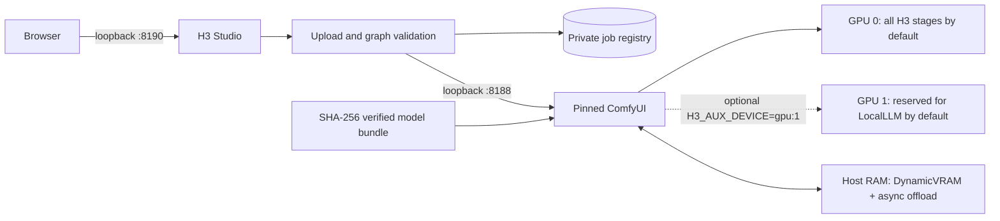

[English](README.md) · [العربية](i18n/README.ar.md) · [Español](i18n/README.es.md) · [Français](i18n/README.fr.md) · [日本語](i18n/README.ja.md) · [한국어](i18n/README.ko.md) · [Tiếng Việt](i18n/README.vi.md) · [中文 (简体)](i18n/README.zh-Hans.md) · [中文（繁體）](i18n/README.zh-Hant.md) · [Deutsch](i18n/README.de.md) · [Русский](i18n/README.ru.md)

[](https://github.com/lachlanchen/lachlanchen/blob/main/figs/banner.png)

# LocalVideoGen

*Maximum-quality, local MiniMax H3 video generation for a dual-RTX 4090 workstation—native picture, sound, references, and careful resource ownership.*

[](https://lazying.art)
[](LICENSE)
[](config/runtime-versions.txt)
[](workflows/)
[](https://github.com/sponsors/lachlanchen)

LocalVideoGen is a reproducible operating layer around a pinned external ComfyUI installation and the official aligned MiniMax H3 model package. It provides a loopback-only H3 Studio webapp, checksum-gated model acquisition, T2V/I2V/R2V workflow presets, native video-and-audio generation, persistent job history, and conservative lifecycle controls tuned for two 24 GiB RTX 4090 GPUs with 128 GiB host RAM.

| Donate | PayPal | Stripe |
| --- | --- | --- |
| [](https://chat.lazying.art/donate) | [](https://paypal.me/RongzhouChen) | [](https://buy.stripe.com/aFadR8gIaflgfQV6T4fw400) |

## H3 Studio

The light theme keeps reference setup, quality controls, and render status readable in one local workspace. The default **Single Clip** setup is intentionally beginner-friendly: choose **Start with words**, describe the scene and sound, then press **Create H3 video**. H3 Studio starts with a 2-second, 864×480 fast preview; final-quality and repeatability controls remain available when needed.

Every creation appears in **Recent sessions** with a plain-language status, prompt title, size, and duration. Opening a session restores its player, and **Reuse settings** copies its prompt and settings into a new attempt. Reference files must be selected again because browser upload handles are deliberately not persisted as reusable file access.


## Build a video series

Switch between **Single Clip** and **Series** without leaving H3 Studio. Series mode offers **LALACHAN Series**, a quality-first **World Travel** preset, and a neutral **My Movie** preset for any cast or visual style.


- Upload shared cast, world, voice, and motion references once, then arrange 2–12 editable shot cards with individual prompts, durations, and seeds.
- World Travel keeps seven canonical logical character/prop pictures at P1–P7, gives every shot its own destination plate at P8, and reserves P9 for the preceding accepted shot's exact final frame. Later shots default to excluding the opening-only Words card, LightMind glasses, and Patchwork notebook, with visible per-shot overrides and an effective H3 map before start. H3 Studio compacts physical slots and safely remaps authored tags while always retaining Zhuangzi Robot, Rara Xia, Aya Chan, and Sasa Kun. Earlier episodes may guide identity or voice only; they cannot steer the new country, plot, blocking, palette, or composition.
- A single admission gate keeps every H3 render strictly sequential. When continuity is enabled, each validated non-final shot supplies its exact final frame and configured 2–4-second tail to the next shot. World Travel defaults to 2 seconds to reduce replay; LALACHAN Series and My Movie retain the 3-second default.
- Pause after the current shot, resume after a restart, retry one shot or everything that follows, and retry post-processing or final stitching without spending GPU time on an already valid MP4.
- Every render attempt remains preserved. The final movie is assembled by lossless stream copy only after checks for the expected frame count, reported average 24 fps, stereo-audio alignment within AAC tolerance, full decode, and SHA-256; a validation manifest is retained beside it.
- Other local projects and Codex sessions can use the dependency-free Series client. It uploads bounded references, verifies server capabilities, writes an atomic durable-ID receipt before generation, survives paused review and polling interruptions, and verifies artifact size plus SHA-256 before installing a download.

The workflow is inspired by the clarity of Xiaoyunque's storyboard experience, but all generation and project state stay on this workstation over loopback. It does not call Xiaoyunque or any paid cloud generation service.

See the [Series workflow guide](docs/series-workflow.md) for continuity and recovery behavior, the [cross-project Series API guide](docs/local-series-api.md) for the stdlib CLI/client and full HTTP contract, and the [smooth long-video options review](docs/smooth-long-video-options.md) for the trusted native H3 baseline, experimental continuity projects, optional interpolation, and quality gates.

Review one paused or completed accepted shot without overwriting retained evidence:

```bash
./scripts/review_series_shot.sh \
  /absolute/path/to/series-receipt.json \
  0 \
  runtime/private/quality-review
```

The zero-based helper downloads the verified accepted MP4 and, for a non-final shot, its current continuity tail and exact final frame. It fully decodes and probes the media, records hashes, creates a full contact sheet and outgoing-boundary strip, and prints—but never runs—an optional Whisper large-v2 command.

## What it delivers

- Highest-quality preset: pruned BF16 Ref2VA/FL2VA DiT, the selected aligned or Heretic NVFP4 Qwen3-VL conditioner, FP16 video VAE, FP32 audio VAE, and 25 full-model steps.
- Shared-workstation stage placement: GPU 0 runs the DiT, denoiser, Qwen/reference conditioning, and final video/audio decode by default, leaving GPU 1 available for LocalLLM or another protected workload. This keeps the same model, BF16 precision, sampler, resolution, and 25-step quality while using GPU-0/CPU offload. On an exclusive workstation, deliberately set `H3_AUX_DEVICE=gpu:1` to move Qwen plus reference-conditioning VAE work to GPU 1; final decode still remains on GPU 0. No PCIe peer-to-peer path is assumed.
- Local T2V, I2V, and multi-reference R2V, including a max-identity reference preset and native synchronized audio.
- Quality, single-GPU fallback, and low-resolution INT8 Turbo preview profiles.
- Local H3 output up to a 768-pixel short edge at 24 fps. MiniMax's separate 2K regeneration stage is API-only and is not presented as a local feature.

## Architecture



The webapp never starts a second ComfyUI process. Services bind to `127.0.0.1`; uploads are normalized into bounded media, browser-visible identifiers are opaque, and output paths are allowlisted.

## Current contents

| Path | Purpose |
| --- | --- |
| [`webapp/`](webapp/) | Responsive H3 Studio, local API, upload normalization, job registry, and tests |
| [`workflows/dual_gpu/`](workflows/dual_gpu/) | BF16/INT8 T2V, I2V, and R2V stage-placement workflows |
| [`workflows/quality/`](workflows/quality/) | Single-GPU 25-step quality workflows |
| [`workflows/preview/`](workflows/preview/) | Small INT8 Turbo preview workflows |
| [`scripts/`](scripts/) | Download, verification, lifecycle, resource, smoke-test, and workflow tools |
| [`config/model-manifest.sha256`](config/model-manifest.sha256) | Exact nine-file model allowlist and SHA-256 checksums |
| [`config/runtime-versions.txt`](config/runtime-versions.txt) | Pinned external runtime versions and commits |

The large `ComfyUI/`, `workflow_templates/`, model weights, outputs, uploads, databases, and runtime receipts are local installations or private/generated state; they are deliberately not committed.

## Quick start

This repository is the public orchestration layer, not a universal installer. Before using these commands, install external `ComfyUI/` and `workflow_templates/` working copies at the exact commits in [`config/runtime-versions.txt`](config/runtime-versions.txt), create `.venv` with the recorded Python/PyTorch/CUDA stack, and install the upstream ComfyUI requirements. Those upstream trees are intentionally not vendored.

The complete official aligned model queue is **147,804,799,439 bytes (137.65 GiB)**. Downloads are resumable, but plan for the model data plus at least 32 GiB of free-space headroom.

```bash
git clone https://github.com/lachlanchen/LocalVideoGen.git
cd LocalVideoGen

# After installing the pinned external runtime:
./scripts/download_models.sh
./scripts/verify_models.sh
./scripts/status.sh

./scripts/start_comfyui.sh
./scripts/start_webapp.sh

# Optional exclusive-workstation speed mode: use both GPUs for H3 stages.
H3_AUX_DEVICE=gpu:1 ./scripts/start_webapp.sh
```

Open <http://127.0.0.1:8190>. ComfyUI remains private at <http://127.0.0.1:8188>.

The local CLIPLoader selection is reversible and applies to H3 Studio plus all generated
editable workflows. The selector verifies the chosen weights before changing anything:

```bash
# Use the optional local Heretic NVFP4 encoder.
./scripts/set_text_encoder.py heretic

# Restore the official aligned Comfy-Org encoder.
./scripts/set_text_encoder.py aligned

# Show the current selection without changing it.
./scripts/set_text_encoder.py status
```

If H3 Studio is already running, restart only the webapp after switching. ComfyUI discovers
both files from `ComfyUI/models/text_encoders/`; neither model is renamed or deleted.

Stop only this project's verified processes when no render is active:

```bash
./scripts/stop_webapp.sh
./scripts/stop_comfyui.sh
```

## Safety and resource controls

- Startup requires at least 48 GiB available RAM, 20,000 MiB free on every requested GPU, and swap use at or below 75%.
- Partial model downloads and changed model size/mtime fingerprints block startup; all nine files are structurally checked and SHA-256 verified.
- PID, boot identity, command line, listener ownership, service marker, and queue state are checked before lifecycle actions.
- GPU cleanup is dry-run by default. Explicit cleanup uses exact pidfds and protects process trees rooted in `LocalLLM` and `AgenticApp`; foreign processes are never stopped automatically.
- Swap is emergency headroom, not a substitute for the RAM launch gate. Only one render engine and one lightweight studio are expected for this project.

## Validate

Run static workflow generation/validation and the webapp tests without submitting a render:

```bash
./scripts/prepare_workflows.py
./scripts/validate_workflows.py
.venv/bin/python -m unittest discover -s webapp/tests -v
./scripts/verify_models.sh
```

With verified models and an idle GPU 0, run the tiny native audio-video smoke graph:

```bash
H3_CUDA_DEVICES=0 ./scripts/start_comfyui.sh
./scripts/smoke_test.sh
H3_SMOKE_MODEL=minimax_h3_fl2va_pruned_bf16.safetensors ./scripts/smoke_test.sh
./scripts/stop_comfyui.sh
```

The five-frame smoke output checks Qwen conditioning, joint video/audio sampling, both VAEs, MP4 muxing, and stream decodability; it is not a visual-quality benchmark.

## License and model territory

The original LocalVideoGen code and documentation are released under the [MIT License](LICENSE). That license does **not** relicense ComfyUI, workflow templates, MiniMax H3 weights, Qwen components, FFmpeg, or any other upstream dependency or generated asset. Each retains its own terms.

No jailbroken or abliterated conditioner is included: the manifest accepts only the aligned Comfy-Org `qwen3vl_32b_minimax_h3_nvfp4_awq.safetensors` file at its recorded checksum. The MiniMax H3 Community License excludes the EU, UK, Republic of Korea, and USA from its applicable territory and adds redistribution obligations; review the [upstream model card](https://huggingface.co/MiniMaxAI/MiniMax-H3), [license](https://huggingface.co/MiniMaxAI/MiniMax-H3/blob/main/LICENSE), applicable law, and every dependency license before downloading or using the weights. This project does not provide legal advice.

## Citation

If you use LocalVideoGen in research, cite the repository. GitHub reads [CITATION.cff](CITATION.cff) and shows a **Cite this repository** panel on the repo page.

```bibtex
@software{chen_localvideogen_2026,
  author = {Chen, Lachlan},
  title = {LocalVideoGen: Resource-Aware Local MiniMax H3 Video Generation},
  year = {2026},
  version = {0.1.0},
  url = {https://github.com/lachlanchen/LocalVideoGen}
}
```

## Status and scope

Version **0.1.0** is a workstation-focused research release, validated on Linux with two RTX 4090 GPUs and 128 GiB RAM. It favors reproducibility, model integrity, visual quality, and safe coexistence with other long-running projects over broad hardware support or one-click setup. Results remain generative and should be reviewed before publication.

Project: [github.com/lachlanchen/LocalVideoGen](https://github.com/lachlanchen/LocalVideoGen) · Homepage: [lazying.art](https://lazying.art)
