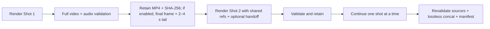

# H3 Studio Series workflow

Series mode turns a storyboard into a validated local movie while keeping MiniMax H3 strictly sequential. It uses the same pinned ComfyUI runtime and quality profiles as Single Clip; no external generation service is contacted.

## Choose a template

- **LALACHAN Series** requires seven stable picture references. It starts with three editable episode-ready shot prompts and continuity guidance for natural Chinese dialogue, character identity, props, and screen direction.
- **My Movie** starts with four optional neutral reference slots and generic opening, development, and ending shots. It works for fiction, documentaries, adverts, product films, and other casts.

The LALACHAN picture order remains fixed in every shot:

| Prompt tag | Reference |
| --- | --- |
| `<Picture 1>` | Words card |
| `<Picture 2>` | Zhuangzi Robot |
| `<Picture 3>` | LightMind glasses |
| `<Picture 4>` | Patchwork notebook |
| `<Picture 5>` | Rara Xia |
| `<Picture 6>` | Aya Chan |
| `<Picture 7>` | Sasa Kun — a human-faced boy in a panda hoodie |

One additional picture slot is reserved for the preceding shot's exact final frame. Up to two shared reference videos are allowed because the third H3 video slot is reserved for the continuity tail.

## Direct the storyboard

1. Switch **Single clip** to **Video series**.
2. Choose a template, project title, and one quality profile for the entire movie.
3. Upload shared cast, world, voice, music, and motion references once.
4. Edit, add, duplicate, delete, or reorder 2–12 shot cards. Every shot has its own title, prompt, requested duration, and seed.
5. Review the aligned 24 fps frame count, total actual duration, canvas, identity fidelity, continuity length, runtime readiness, and reference limits in preflight.
6. Select **Save & start new storyboard**. H3 Studio stores a durable private project before asking the local engine to render.

## How continuity advances

Only one render may pass the shared submission gate. The next shot is not submitted until the previous MP4 has the expected canvas and exact frame count, a reported average frame rate within 0.01 fps of 24, timeline-aligned 32 kHz stereo audio within AAC tolerances, a successful full decode, and a recorded SHA-256 digest.

When continuity is enabled, H3 Studio retains an accurately trimmed 2-, 3-, or 4-second continuity video and exact final frame for each non-final shot, uploads those derived files to the same local ComfyUI input area, and appends deterministic continuity instructions to the next authored prompt. Three seconds is the default. The final shot does not create an unused handoff.

## Pause, recover, and retry

- **Pause after this shot** lets the current expensive generation finish and save before stopping the series.
- A queued, running, pausing, stitching, or failed project survives browser and webapp restarts in the private SQLite registry.
- **Regenerate from here** creates new attempts for the selected shot and its dependent successors. Nothing is deleted; affected accepted attempts and their dependent shot/final artifacts are marked superseded, while other retained attempts and continuity artifacts remain available as history.
- A validated generated MP4 whose continuity-tail upload or later post-processing failed can resume post-processing without another H3 render.
- **Retry stitching — no shots regenerate** rebuilds only the final MP4 and manifest from accepted shots.
- A cancel request affects only the currently owned series job. If the engine completed at the cancellation boundary, the finished MP4 is preserved and exposed instead of being hidden as cancelled.

## Final movie and private storage

Accepted shot MP4s are revalidated and re-hashed immediately before final assembly. Identical series settings allow FFmpeg's concat demuxer to stream-copy video and audio without another lossy encode. The stitched movie is then fully decoded and checked against the exact sum of accepted shot frames. A versioned JSON manifest records each accepted attempt, source hash, final hash, media properties, and lossless-concat status.

Upload and artifact API records expose opaque handles and allowlisted URLs, never those files' local filesystem paths. The setup panel intentionally shows this workstation's local engine start command. Durable project state and derived artifacts live below `runtime/private/`; original H3 renders stay in `ComfyUI/output/`. Neither location is committed to Git.

## Local API outline

| Action | Endpoint |
| --- | --- |
| Create a durable storyboard | `POST /api/series` |
| List compact saved projects | `GET /api/series` |
| Read or replace a ready project | `GET/PUT /api/series/{id}` |
| Start, pause, or resume | `POST /api/series/{id}/start`, `/pause`, `/resume` |
| Cancel the owned active shot | `POST /api/series/{id}/cancel-active` |
| Regenerate a shot and optionally its successors | `POST /api/series/{id}/shots/{index}/retry` |
| Retry final assembly only | `POST /api/series/{id}/retry-finalization` |
| Stream an allowlisted artifact | `GET /api/series/{id}/artifacts/{artifact_id}` |

The web interface is the supported way to build projects; the API exists so the local UI can remain durable, inspectable, and testable.
