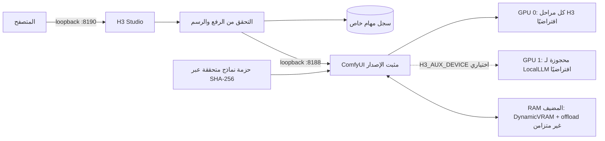

[English](../README.md) · [العربية](README.ar.md) · [Español](README.es.md) · [Français](README.fr.md) · [日本語](README.ja.md) · [한국어](README.ko.md) · [Tiếng Việt](README.vi.md) · [中文 (简体)](README.zh-Hans.md) · [中文（繁體）](README.zh-Hant.md) · [Deutsch](README.de.md) · [Русский](README.ru.md)

[](https://github.com/lachlanchen/lachlanchen/blob/main/figs/banner.png)

# LocalVideoGen

*توليد فيديو MiniMax H3 محلي بأعلى جودة لمحطة عمل ببطاقتي RTX 4090—صورة وصوت ومراجع أصلية، مع إدارة دقيقة لملكية الموارد.*

[](https://lazying.art)
[](../LICENSE)
[](../config/runtime-versions.txt)
[](../workflows/)
[](https://github.com/sponsors/lachlanchen)

LocalVideoGen طبقة تشغيل قابلة لإعادة الإنتاج فوق تثبيت خارجي مثبت الإصدار من ComfyUI وحزمة MiniMax H3 الرسمية المتوافقة. يوفّر تطبيق H3 Studio عبر واجهة loopback المحلية فقط، وتنزيل النماذج المشروط بمجاميع التحقق، ومسارات T2V/I2V/R2V، وتوليد الفيديو والصوت الأصليين معًا، وسجل مهام دائمًا، وضوابط محافظة لدورة الحياة مضبوطة لبطاقتي RTX 4090 بسعة 24 GiB وذاكرة مضيفة قدرها 128 GiB.

للمراجع المرئية الطويلة، استخدم إعداد **Long reference · 24 GiB safe**: ‏`quality_int8_offload` مع `match` ومقاس 704×1248 عمودي أو 1248×704 أفقي. تتحقق بوابة ما قبل الإرسال من الأبعاد وحمل المراجع، وترفض المهمة قبل وصولها إلى GPU إذا تجاوزت الحد الآمن.

| Donate | PayPal | Stripe |
| --- | --- | --- |
| [](https://chat.lazying.art/donate) | [](https://paypal.me/RongzhouChen) | [](https://buy.stripe.com/aFadR8gIaflgfQV6T4fw400) |

## واجهة H3 Studio

يجعل المظهر الفاتح إعداد المراجع وضوابط الجودة وحالة التوليد واضحة ضمن مساحة عمل محلية واحدة.


## إنشاء سلسلة فيديو

يمكن التبديل بين **Single Clip** و **Series** من دون مغادرة H3 Studio. يوفّر وضع السلسلة إعداد **LALACHAN Series**، وإعداد **World Travel** الذي يضع الجودة أولاً، وإعداد **My Movie** المحايد لأي طاقم أو أسلوب بصري.


- ارفع مراجع الشخصيات والعالم والأصوات والحركة مرة واحدة، ثم رتّب من 2 إلى 12 بطاقة لقطة قابلة للتحرير، ولكل منها الوصف والمدة والبذرة الخاصة بها.
- يثبّت **World Travel** صور الشخصيات والأدوات السبع المعتمدة في P1–P7، ويمنح كل لقطة لوحة وجهة خاصة بها في P8، ويحجز P9 للإطار الأخير الدقيق من اللقطة السابقة المقبولة. يمكن للحلقات السابقة أن ترشد الهوية أو الصوت فقط؛ ولا يمكنها توجيه البلد الجديد أو الحبكة أو توزيع الحركة في المشهد أو لوحة الألوان أو التكوين.
- بوابة قبول واحدة تجعل توليد H3 متسلسلاً بالكامل. عند تفعيل الاستمرارية، تزوّد كل لقطة غير أخيرة تم التحقق منها اللقطة التالية بإطارها الأخير الدقيق وذيل مضبوط بين ثانيتين وأربع ثوانٍ (ثلاث ثوانٍ افتراضياً).
- يمكنك الإيقاف بعد اللقطة الحالية، والاستئناف بعد إعادة التشغيل، وإعادة لقطة وما يليها، أو إعادة المعالجة النهائية والدمج من دون إنفاق وقت GPU على ملف MP4 صالح مسبقاً.
- تُحفظ كل محاولة توليد. لا يُجمع الفيلم النهائي بالنسخ المباشر من التدفقات من دون فقد إلا بعد فحص عدد الإطارات المتوقع ومتوسط 24 fps المُبلّغ عنه ومحاذاة الصوت المجسّم ضمن هامش AAC وفك الترميز الكامل وSHA-256، مع الاحتفاظ ببيان تحقق.
- تستطيع المشاريع المحلية الأخرى وجلسات Codex استخدام عميل Series الخالي من التبعيات والمبني على Python stdlib. يرفع مراجع محدودة الحجم، ويتحقق من إمكانات الخادم، ويكتب إيصالاً ذرياً بالمعرّف الدائم قبل بدء التوليد، ويتحمّل توقف المراجعة وانقطاع الاستطلاع، ويتحقق من حجم العنصر وSHA-256 قبل تثبيت التنزيل.

استُلهم وضوح تجربة القصة المصوّرة من Xiaoyunque، لكن التوليد وحالة المشروع يبقيان محليين على محطة العمل عبر loopback؛ ولا يجري استدعاء Xiaoyunque أو أي خدمة توليد سحابية مدفوعة.

راجع [دليل سير عمل السلسلة](../docs/series-workflow.md) لمعرفة سلوك الاستمرارية والاستعادة، و[دليل Series API للاستخدام بين المشاريع](../docs/local-series-api.md) لعميل/واجهة سطر الأوامر المبنيين على stdlib وعقد HTTP الكامل، و[مراجعة خيارات الفيديو الطويل السلس](../docs/smooth-long-video-options.md) لخط أساس H3 الأصلي الموثوق، ومشاريع الاستمرارية التجريبية، والاستيفاء الاختياري، وبوابات الجودة.

## ما الذي يقدمه

- إعداد BF16 بأعلى دقة للمراجع المرئية القصيرة أو R2V المعتمد على الصور فقط؛ أما مراجع الفيديو الطويلة فتستخدم افتراضيًا مسار INT8/offload الآمن المقاس بسعة 24 GiB.
- في محطة العمل المشتركة تنفذ GPU 0 جميع مراحل H3 افتراضيًا وتبقى GPU 1 متاحة لـ LocalLLM. ينقل الضبط الصريح `H3_AUX_DEVICE=gpu:1` تكييف Qwen وVAE المرجعي إلى GPU 1.
- ‏T2V وI2V وR2V متعدد المراجع محليًا، بما فيه إعداد max-identity وصوت أصلي متزامن.
- إعدادات للجودة، والرجوع إلى بطاقة واحدة، ومعاينة INT8 Turbo منخفضة الدقة.
- يصل خرج H3 المحلي إلى ضلع قصير 768 بكسل عند 24 fps. مرحلة إعادة التوليد 2K المنفصلة لدى MiniMax متاحة عبر API فقط ولا تُقدّم بوصفها ميزة محلية.

## البنية



لا يبدأ تطبيق الويب مطلقًا عملية ComfyUI ثانية. ترتبط الخدمات بـ `127.0.0.1` فقط؛ وتُطبّع الملفات المرفوعة إلى وسائط محدودة، وتكون المعرّفات الظاهرة للمتصفح مبهمة، وتقتصر مسارات الخرج على قائمة سماح.

## المحتويات الحالية

| المسار | الغرض |
| --- | --- |
| [`webapp/`](../webapp/) | ‏H3 Studio متجاوب، وAPI محلي، وتطبيع الرفع، وسجل المهام، والاختبارات |
| [`workflows/dual_gpu/`](../workflows/dual_gpu/) | مسارات BF16/INT8 من T2V وI2V وR2V موزعة على مراحل |
| [`workflows/quality/`](../workflows/quality/) | مسارات جودة من 25 خطوة لبطاقة واحدة |
| [`workflows/preview/`](../workflows/preview/) | مسارات معاينة INT8 Turbo صغيرة |
| [`scripts/`](../scripts/) | أدوات التنزيل والتحقق ودورة الحياة والموارد واختبار smoke والمسارات |
| [`config/model-manifest.sha256`](../config/model-manifest.sha256) | قائمة سماح دقيقة لتسعة ملفات ومجاميع SHA-256 |
| [`config/runtime-versions.txt`](../config/runtime-versions.txt) | إصدارات وcommits بيئة التشغيل الخارجية المثبتة |

مجلدا `ComfyUI/` و`workflow_templates/` الكبيران، والأوزان، والمخرجات، والملفات المرفوعة، وقواعد البيانات، وإيصالات التشغيل هي تثبيتات محلية أو حالة خاصة/مولدة، ولذلك لا تُضمَّن عمدًا في commits.

## بدء سريع

هذا المستودع هو طبقة التنسيق العامة، وليس مثبّتًا عامًا. قبل استخدام الأوامر، ثبّت نسخ العمل الخارجية `ComfyUI/` و`workflow_templates/` عند commits الدقيقة في [`config/runtime-versions.txt`](../config/runtime-versions.txt)، وأنشئ `.venv` باستخدام حزمة Python/PyTorch/CUDA المسجلة، وثبّت متطلبات ComfyUI الأصلية. لا تُضمّن أشجار upstream عمدًا.

يبلغ حجم قائمة النماذج الرسمية المتوافقة الكاملة **147,804,799,439 بايت (137.65 GiB)**. يمكن استئناف التنزيل، لكن خصص 32 GiB إضافية على الأقل من المساحة الحرة فوق بيانات النماذج.

```bash
git clone https://github.com/lachlanchen/LocalVideoGen.git
cd LocalVideoGen

# بعد تثبيت بيئة التشغيل الخارجية المثبتة:
./scripts/download_models.sh
./scripts/verify_models.sh
./scripts/status.sh

./scripts/start_comfyui.sh
./scripts/start_webapp.sh
```

افتح <http://127.0.0.1:8190>. يبقى ComfyUI خاصًا عند <http://127.0.0.1:8188>.

عند عدم وجود render نشط، أوقف عمليات هذا المشروع المتحقق منها فقط:

```bash
./scripts/stop_webapp.sh
./scripts/stop_comfyui.sh
```

## السلامة وضبط الموارد

- يتطلب البدء 48 GiB على الأقل من RAM المتاحة، و20,000 MiB من VRAM الحرة على كل GPU مطلوبة، وألا يتجاوز استخدام swap نسبة 75%.
- تمنع التنزيلات الجزئية أو تغيّر بصمة الحجم/mtime التشغيل؛ وتخضع الملفات التسعة لفحص بنيوي وتحقق SHA-256.
- يجري التحقق من PID وهوية الإقلاع وسطر الأوامر وملكية listener وعلامة الخدمة وحالة الطابور قبل إجراءات دورة الحياة.
- تنظيف GPU هو dry-run افتراضيًا. يستخدم التنظيف الصريح pidfds دقيقة ويحمي أشجار العمليات تحت `LocalLLM` و`AgenticApp`؛ ولا يوقف عمليات خارجية تلقائيًا.
- ‏swap هامش طوارئ وليس بديلًا لحد RAM. يُتوقع محرك render واحد وStudio خفيف واحد لهذا المشروع.

## التحقق

أنشئ المسارات الثابتة وتحقق منها وشغّل اختبارات تطبيق الويب دون إرسال render:

```bash
./scripts/prepare_workflows.py
./scripts/validate_workflows.py
.venv/bin/python -m unittest discover -s webapp/tests -v
./scripts/verify_models.sh
```

مع نماذج متحقق منها وGPU 0 خاملة، شغّل رسم smoke الصغير للفيديو والصوت الأصليين:

```bash
H3_CUDA_DEVICES=0 ./scripts/start_comfyui.sh
./scripts/smoke_test.sh
H3_SMOKE_MODEL=minimax_h3_fl2va_pruned_bf16.safetensors ./scripts/smoke_test.sh
./scripts/stop_comfyui.sh
```

يتحقق خرج الخمس إطارات من Qwen conditioning، وأخذ عينات الفيديو/الصوت معًا، وVAE كليهما، وMP4 mux، وإمكان فك ترميز streams؛ وليس معيارًا للجودة البصرية.

## الترخيص والنطاق الإقليمي للنموذج

يُنشر كود LocalVideoGen الأصلي ووثائقه وفق [MIT License](../LICENSE). **لا يعيد** هذا الترخيص ترخيص ComfyUI أو workflow templates أو أوزان MiniMax H3 أو مكونات Qwen أو FFmpeg أو أي تبعيات upstream أو أصول مولدة. يحتفظ كل منها بشروطه.

لا يُضمّن أي conditioner من نوع jailbroken أو abliterated: لا يقبل manifest سوى ملف Comfy-Org المتوافق `qwen3vl_32b_minimax_h3_nvfp4_awq.safetensors` بمجموع التحقق المسجل. يستثني MiniMax H3 Community License الاتحاد الأوروبي والمملكة المتحدة وجمهورية كوريا والولايات المتحدة من نطاقه الإقليمي ويضيف التزامات إعادة توزيع. راجع [بطاقة النموذج الأصلية](https://huggingface.co/MiniMaxAI/MiniMax-H3) و[الترخيص](https://huggingface.co/MiniMaxAI/MiniMax-H3/blob/main/LICENSE) والقانون المنطبق وكل تراخيص التبعيات قبل تنزيل الأوزان أو استخدامها. لا يقدم هذا المشروع مشورة قانونية.

## الاستشهاد

إذا استخدمت LocalVideoGen في بحث، فاستشهد بهذا المستودع. يقرأ GitHub ملف [CITATION.cff](../CITATION.cff) ويعرض لوحة **Cite this repository** في صفحة المستودع.

```bibtex
@software{chen_localvideogen_2026,
  author = {Chen, Lachlan},
  title = {LocalVideoGen: Resource-Aware Local MiniMax H3 Video Generation},
  year = {2026},
  version = {0.1.0},
  url = {https://github.com/lachlanchen/LocalVideoGen}
}
```

## الحالة والنطاق

الإصدار **0.1.0** إصدار بحثي موجه لمحطة العمل، جرى التحقق منه على Linux ببطاقتي RTX 4090 وذاكرة 128 GiB. يعطي الأولوية لقابلية إعادة الإنتاج وسلامة النماذج والجودة البصرية والتعايش الآمن مع المشاريع الأخرى طويلة التشغيل على حساب دعم عتاد واسع أو تثبيت بنقرة واحدة. تبقى النتائج توليدية ويجب مراجعتها قبل النشر.

المشروع: [github.com/lachlanchen/LocalVideoGen](https://github.com/lachlanchen/LocalVideoGen) · الصفحة الرئيسية: [lazying.art](https://lazying.art)
