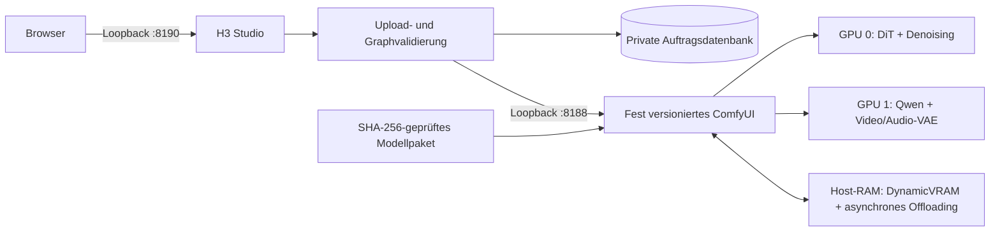

[English](../README.md) · [العربية](README.ar.md) · [Español](README.es.md) · [Français](README.fr.md) · [日本語](README.ja.md) · [한국어](README.ko.md) · [Tiếng Việt](README.vi.md) · [中文 (简体)](README.zh-Hans.md) · [中文（繁體）](README.zh-Hant.md) · [Deutsch](README.de.md) · [Русский](README.ru.md)

[](https://github.com/lachlanchen/lachlanchen/blob/main/figs/banner.png)

# LocalVideoGen

*Lokale MiniMax-H3-Videogenerierung in maximaler Qualität für eine Dual-RTX-4090-Workstation – mit nativem Bild, Ton und Referenzen sowie sorgfältiger Ressourcenverantwortung.*

[](https://lazying.art)
[](../LICENSE)
[](../config/runtime-versions.txt)
[](../workflows/)
[](https://github.com/sponsors/lachlanchen)

LocalVideoGen ist eine reproduzierbare Betriebsschicht um eine extern installierte, fest versionierte ComfyUI-Umgebung und das offizielle ausgerichtete MiniMax-H3-Modellpaket. Enthalten sind die nur über Loopback erreichbare Webapp H3 Studio, prüfsummengesteuerter Modellbezug, T2V/I2V/R2V-Workflows, gemeinsame native Video- und Audioerzeugung, dauerhafte Auftragsprotokolle sowie konservative Lebenszyklusregeln für zwei RTX 4090 mit je 24 GiB und 128 GiB Host-RAM.

| Donate | PayPal | Stripe |
| --- | --- | --- |
| [](https://chat.lazying.art/donate) | [](https://paypal.me/RongzhouChen) | [](https://buy.stripe.com/aFadR8gIaflgfQV6T4fw400) |

## H3 Studio im Einsatz

Das helle Design zeigt Referenzeinrichtung, Qualitätsregler und Renderstatus übersichtlich in einem lokalen Arbeitsbereich.


## Leistungsumfang

- Höchste Qualitätsstufe: beschnittenes BF16 Ref2VA/FL2VA DiT, ausgerichteter NVFP4-AWQ Qwen3-VL-Conditioner, FP16-Video-VAE, FP32-Audio-VAE und 25 Vollmodellschritte.
- Stufenverteilung auf zwei GPUs: GPU 0 führt DiT und Denoising aus; GPU 1 übernimmt Qwen-Conditioning sowie Video-/Audio-VAE. Ein PCIe-Peer-to-Peer-Pfad wird nicht vorausgesetzt.
- Lokales T2V, I2V und R2V mit mehreren Referenzen, einschließlich Max-Identity-Profil und nativ synchronisiertem Audio.
- Profile für Qualität, Ein-GPU-Rückfall und niedrig aufgelöste INT8-Turbo-Vorschau.
- Lokales H3 liefert bei 24 fps bis zu 768 Pixel an der kurzen Kante. MiniMax' separate 2K-Regenerierung ist nur per API verfügbar und wird nicht als lokale Funktion dargestellt.

## Architektur



Die Webapp startet niemals einen zweiten ComfyUI-Prozess. Dienste binden nur an `127.0.0.1`; Uploads werden in begrenzte Medien normalisiert, im Browser sichtbare Kennungen sind undurchsichtig und Ausgabepfade stehen auf einer Positivliste.

## Aktueller Inhalt

| Pfad | Zweck |
| --- | --- |
| [`webapp/`](../webapp/) | Responsives H3 Studio, lokale API, Upload-Normalisierung, Auftragsdatenbank und Tests |
| [`workflows/dual_gpu/`](../workflows/dual_gpu/) | BF16/INT8-T2V-, I2V- und R2V-Workflows mit Stufenverteilung |
| [`workflows/quality/`](../workflows/quality/) | 25-Schritt-Qualitätsworkflows für eine GPU |
| [`workflows/preview/`](../workflows/preview/) | Kleine INT8-Turbo-Vorschauworkflows |
| [`scripts/`](../scripts/) | Werkzeuge für Download, Prüfung, Lebenszyklus, Ressourcen, Smoke-Test und Workflows |
| [`config/model-manifest.sha256`](../config/model-manifest.sha256) | Exakte Positivliste aus neun Modelldateien und SHA-256-Prüfsummen |
| [`config/runtime-versions.txt`](../config/runtime-versions.txt) | Festgelegte Versionen und Commits der externen Laufzeit |

Die großen Verzeichnisse `ComfyUI/` und `workflow_templates/`, Modellgewichte, Ausgaben, Uploads, Datenbanken und Laufzeitbelege sind lokale Installationen oder privater/generierter Zustand und werden bewusst nicht committet.

## Schnellstart

Dieses Repository ist die öffentliche Orchestrierungsschicht, kein universeller Installer. Installieren Sie vor diesen Befehlen externe Arbeitskopien von `ComfyUI/` und `workflow_templates/` auf den exakten Commits in [`config/runtime-versions.txt`](../config/runtime-versions.txt), erstellen Sie `.venv` mit dem dort erfassten Python/PyTorch/CUDA-Stack und installieren Sie die Upstream-ComfyUI-Abhängigkeiten. Diese Upstream-Bäume sind absichtlich nicht eingebettet.

Die vollständige offizielle, ausgerichtete Modellwarteschlange umfasst **147.804.799.439 Bytes (137,65 GiB)**. Downloads sind fortsetzbar; planen Sie zusätzlich zu den Modelldaten mindestens 32 GiB freien Speicher ein.

```bash
git clone https://github.com/lachlanchen/LocalVideoGen.git
cd LocalVideoGen

# Nach Installation der festgelegten externen Laufzeit:
./scripts/download_models.sh
./scripts/verify_models.sh
./scripts/status.sh

./scripts/start_comfyui.sh
./scripts/start_webapp.sh
```

Öffnen Sie <http://127.0.0.1:8190>. ComfyUI bleibt unter <http://127.0.0.1:8188> privat.

Stoppen Sie bei inaktivem Rendering nur die verifizierten Prozesse dieses Projekts:

```bash
./scripts/stop_webapp.sh
./scripts/stop_comfyui.sh
```

## Sicherheits- und Ressourcenregeln

- Der Start erfordert mindestens 48 GiB verfügbaren RAM, 20.000 MiB freien VRAM auf jeder angeforderten GPU und höchstens 75 % Swap-Auslastung.
- Unvollständige Downloads und geänderte Größen-/mtime-Fingerabdrücke blockieren den Start; alle neun Dateien werden strukturell und per SHA-256 geprüft.
- Vor Lebenszyklusaktionen werden PID, Boot-Identität, Kommandozeile, Listener-Eigentümer, Dienstmarkierung und Warteschlangenstatus verifiziert.
- GPU-Bereinigung ist standardmäßig ein Dry-Run. Explizite Bereinigung nutzt exakte pidfds und schützt Prozessbäume unter `LocalLLM` und `AgenticApp`; fremde Prozesse werden nie automatisch beendet.
- Swap ist eine Notreserve und ersetzt nicht die RAM-Startschwelle. Für dieses Projekt sind nur eine Render-Engine und ein leichtgewichtiges Studio vorgesehen.

## Validierung

Statische Workflows und Webapp-Tests lassen sich ohne Renderauftrag ausführen:

```bash
./scripts/prepare_workflows.py
./scripts/validate_workflows.py
.venv/bin/python -m pytest -q webapp/tests
./scripts/verify_models.sh
```

Mit verifizierten Modellen und freier GPU 0 kann der kleine native Audio-Video-Smoke-Graph ausgeführt werden:

```bash
H3_CUDA_DEVICES=0 ./scripts/start_comfyui.sh
./scripts/smoke_test.sh
H3_SMOKE_MODEL=minimax_h3_fl2va_pruned_bf16.safetensors ./scripts/smoke_test.sh
./scripts/stop_comfyui.sh
```

Die Ausgabe mit fünf Frames prüft Qwen-Conditioning, gemeinsames Video-/Audio-Sampling, beide VAEs, MP4-Muxing und Stream-Dekodierbarkeit; sie ist kein visueller Qualitätsbenchmark.

## Lizenz und Modellgebiet

Der ursprüngliche LocalVideoGen-Code und die Dokumentation stehen unter der [MIT License](../LICENSE). Diese Lizenz **lizenziert ComfyUI, workflow templates, MiniMax-H3-Gewichte, Qwen-Komponenten, FFmpeg, andere Upstream-Abhängigkeiten oder generierte Inhalte nicht neu**. Deren eigene Bedingungen gelten fort.

Ein jailbroken oder abliterated Conditioner ist nicht enthalten: Das Manifest akzeptiert ausschließlich die ausgerichtete Comfy-Org-Datei `qwen3vl_32b_minimax_h3_nvfp4_awq.safetensors` mit der hinterlegten Prüfsumme. Die MiniMax H3 Community License schließt EU, Vereinigtes Königreich, Republik Korea und USA aus ihrem Anwendungsgebiet aus und enthält Weitergabepflichten. Prüfen Sie vor Download oder Nutzung die [Upstream-Modellkarte](https://huggingface.co/MiniMaxAI/MiniMax-H3), die [Lizenz](https://huggingface.co/MiniMaxAI/MiniMax-H3/blob/main/LICENSE), das anwendbare Recht und alle Abhängigkeitslizenzen. Dieses Projekt bietet keine Rechtsberatung.

## Zitierung

Wenn Sie LocalVideoGen in der Forschung verwenden, zitieren Sie dieses Repository. GitHub liest [CITATION.cff](../CITATION.cff) und zeigt auf der Repository-Seite den Bereich **Cite this repository** an.

```bibtex
@software{chen_localvideogen_2026,
  author = {Chen, Lachlan},
  title = {LocalVideoGen: Resource-Aware Local MiniMax H3 Video Generation},
  year = {2026},
  version = {0.1.0},
  url = {https://github.com/lachlanchen/LocalVideoGen}
}
```

## Status und Umfang

Version **0.1.0** ist eine workstationbezogene Forschungsversion, validiert unter Linux mit zwei RTX 4090 und 128 GiB RAM. Sie priorisiert Reproduzierbarkeit, Modellintegrität, visuelle Qualität und das sichere Nebeneinander mit anderen Langzeitprojekten vor breiter Hardwareunterstützung oder Ein-Klick-Einrichtung. Ergebnisse bleiben generativ und sollten vor Veröffentlichung geprüft werden.

Projekt: [github.com/lachlanchen/LocalVideoGen](https://github.com/lachlanchen/LocalVideoGen) · Homepage: [lazying.art](https://lazying.art)
