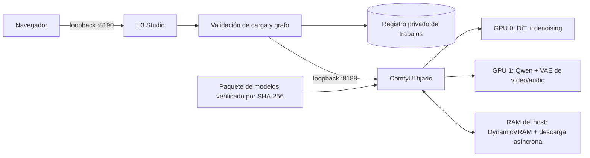

[English](../README.md) · [العربية](README.ar.md) · [Español](README.es.md) · [Français](README.fr.md) · [日本語](README.ja.md) · [한국어](README.ko.md) · [Tiếng Việt](README.vi.md) · [中文 (简体)](README.zh-Hans.md) · [中文（繁體）](README.zh-Hant.md) · [Deutsch](README.de.md) · [Русский](README.ru.md)

[](https://github.com/lachlanchen/lachlanchen/blob/main/figs/banner.png)

# LocalVideoGen

*Generación local de vídeo MiniMax H3 con la máxima calidad para una estación con dos RTX 4090: imagen, sonido y referencias nativas, con una gestión cuidadosa de los recursos.*

[](https://lazying.art)
[](../LICENSE)
[](../config/runtime-versions.txt)
[](../workflows/)
[](https://github.com/sponsors/lachlanchen)

LocalVideoGen es una capa operativa reproducible sobre una instalación externa y fijada de ComfyUI y el paquete oficial alineado de MiniMax H3. Incluye la aplicación web H3 Studio limitada a loopback, descarga de modelos controlada por sumas de verificación, flujos T2V/I2V/R2V, generación nativa conjunta de vídeo y audio, historial persistente y controles conservadores del ciclo de vida, ajustados para dos RTX 4090 de 24 GiB y 128 GiB de RAM.

| Donate | PayPal | Stripe |
| --- | --- | --- |
| [](https://chat.lazying.art/donate) | [](https://paypal.me/RongzhouChen) | [](https://buy.stripe.com/aFadR8gIaflgfQV6T4fw400) |

## H3 Studio en acción

El tema claro reúne de forma legible la configuración de referencias, los controles de calidad y el estado del render en un espacio local.


## Crear una serie de vídeo

H3 Studio permite alternar entre **Single Clip** y **Series** sin salir del espacio de trabajo. El modo de serie ofrece **LALACHAN Series**, el preajuste **World Travel** orientado a la máxima calidad y el preajuste neutro **My Movie** para cualquier reparto o estilo visual.


- Sube una sola vez las referencias compartidas de reparto, mundo, voces y movimiento, y organiza entre 2 y 12 tarjetas de plano editables con prompt, duración y semilla propios.
- **World Travel** fija las siete imágenes canónicas de personajes y objetos en P1–P7, asigna a cada plano su propia lámina de destino en P8 y reserva P9 para el fotograma final exacto del plano anterior aceptado. Los episodios anteriores solo pueden orientar la identidad o la voz; no pueden dirigir el nuevo país, la trama, la puesta en escena, la paleta ni la composición.
- Una única puerta de admisión mantiene todos los renders H3 estrictamente secuenciales. Cuando la continuidad está activa, cada plano no final validado entrega al siguiente su fotograma final exacto y una cola configurada de 2–4 segundos (3 segundos de forma predeterminada).
- Pausa después del plano actual, reanuda tras reiniciar, repite un plano y los posteriores, o reintenta el posprocesado y el montaje final sin gastar GPU en un MP4 que ya es válido.
- Se conserva cada intento. La película final se ensambla mediante copia de flujos sin pérdida solo después de comprobar el número esperado de fotogramas, el promedio declarado de 24 fps, la alineación del audio estéreo dentro de la tolerancia AAC, la decodificación completa y SHA-256; también se guarda un manifiesto de validación.
- Otros proyectos locales y sesiones de Codex pueden usar el cliente Series sin dependencias, basado exclusivamente en Python stdlib. Carga referencias con límites de tamaño, verifica las capacidades del servidor, escribe de forma atómica un recibo con el identificador duradero antes de generar, tolera revisiones en pausa e interrupciones del sondeo, y comprueba el tamaño y SHA-256 de cada artefacto antes de instalar una descarga.

El flujo toma como referencia la claridad del storyboard de Xiaoyunque, pero la generación y el estado del proyecto permanecen en esta estación mediante loopback. No llama a Xiaoyunque ni a servicios de generación en la nube de pago.

Consulta la [guía del flujo de series](../docs/series-workflow.md) para conocer la continuidad y la recuperación, la [guía de Series API entre proyectos](../docs/local-series-api.md) para el cliente/CLI stdlib y el contrato HTTP completo, y la [revisión de opciones para vídeos largos fluidos](../docs/smooth-long-video-options.md) para la base H3 nativa de confianza, los proyectos experimentales de continuidad, la interpolación opcional y los controles de calidad.

## Qué ofrece

- Perfil de máxima calidad: DiT Ref2VA/FL2VA podado en BF16, acondicionador Qwen3-VL NVFP4-AWQ alineado, VAE de vídeo FP16, VAE de audio FP32 y 25 pasos del modelo completo.
- Distribución por etapas entre dos GPU: GPU 0 ejecuta DiT y denoising; GPU 1 ejecuta el condicionamiento Qwen y los VAE de vídeo/audio. No presupone un enlace PCIe peer-to-peer.
- T2V, I2V y R2V multirreferencia locales, con perfil de máxima identidad y audio nativo sincronizado.
- Perfiles de calidad, respaldo con una sola GPU y vista previa INT8 Turbo de baja resolución.
- H3 local admite hasta 768 píxeles en el lado corto a 24 fps. La etapa separada de regeneración 2K de MiniMax solo está disponible por API y no se presenta como función local.

## Arquitectura



La aplicación web nunca inicia un segundo proceso de ComfyUI. Los servicios solo escuchan en `127.0.0.1`; las cargas se normalizan como medios acotados, los identificadores visibles en el navegador son opacos y las rutas de salida están en una lista permitida.

## Contenido actual

| Ruta | Finalidad |
| --- | --- |
| [`webapp/`](../webapp/) | H3 Studio adaptable, API local, normalización de cargas, registro de trabajos y pruebas |
| [`workflows/dual_gpu/`](../workflows/dual_gpu/) | Flujos BF16/INT8 T2V, I2V y R2V con distribución por etapas |
| [`workflows/quality/`](../workflows/quality/) | Flujos de calidad de 25 pasos para una GPU |
| [`workflows/preview/`](../workflows/preview/) | Flujos pequeños de vista previa INT8 Turbo |
| [`scripts/`](../scripts/) | Herramientas de descarga, verificación, ciclo de vida, recursos, smoke test y flujos |
| [`config/model-manifest.sha256`](../config/model-manifest.sha256) | Lista exacta de nueve archivos permitidos y sumas SHA-256 |
| [`config/runtime-versions.txt`](../config/runtime-versions.txt) | Versiones y commits fijados del entorno externo |

Los grandes directorios `ComfyUI/` y `workflow_templates/`, los pesos, resultados, cargas, bases de datos y recibos de ejecución son instalaciones locales o estado privado/generado, y no se incluyen deliberadamente en commits.

## Inicio rápido

Este repositorio es la capa pública de orquestación, no un instalador universal. Antes de usar estos comandos, instale copias externas de `ComfyUI/` y `workflow_templates/` en los commits exactos de [`config/runtime-versions.txt`](../config/runtime-versions.txt), cree `.venv` con la pila Python/PyTorch/CUDA registrada e instale los requisitos de ComfyUI. Los árboles upstream no se incorporan intencionadamente.

La cola oficial completa de modelos alineados ocupa **147.804.799.439 bytes (137,65 GiB)**. Las descargas se pueden reanudar; reserve además al menos 32 GiB de espacio libre.

```bash
git clone https://github.com/lachlanchen/LocalVideoGen.git
cd LocalVideoGen

# Después de instalar el entorno externo fijado:
./scripts/download_models.sh
./scripts/verify_models.sh
./scripts/status.sh

./scripts/start_comfyui.sh
./scripts/start_webapp.sh
```

Abra <http://127.0.0.1:8190>. ComfyUI permanece privado en <http://127.0.0.1:8188>.

Cuando no haya un render activo, detenga únicamente los procesos verificados de este proyecto:

```bash
./scripts/stop_webapp.sh
./scripts/stop_comfyui.sh
```

## Seguridad y control de recursos

- El inicio exige 48 GiB de RAM disponible, 20.000 MiB libres en cada GPU solicitada y un uso de swap no superior al 75 %.
- Las descargas parciales o cambios en la huella tamaño/mtime bloquean el inicio; los nueve archivos se inspeccionan estructuralmente y se verifican con SHA-256.
- Antes de actuar sobre el ciclo de vida se comprueban PID, identidad de arranque, línea de comandos, propietario del listener, marcador de servicio y estado de la cola.
- La limpieza de GPU es un dry-run por defecto. La limpieza explícita usa pidfds exactos y protege los árboles bajo `LocalLLM` y `AgenticApp`; nunca detiene automáticamente procesos ajenos.
- El swap es margen de emergencia, no sustituye el umbral de RAM. El proyecto espera un solo motor de render y un Studio ligero.

## Validación

Genere y valide los flujos estáticos y ejecute las pruebas web sin enviar un render:

```bash
./scripts/prepare_workflows.py
./scripts/validate_workflows.py
.venv/bin/python -m unittest discover -s webapp/tests -v
./scripts/verify_models.sh
```

Con modelos verificados y GPU 0 inactiva, ejecute el pequeño grafo nativo de smoke test audiovisual:

```bash
H3_CUDA_DEVICES=0 ./scripts/start_comfyui.sh
./scripts/smoke_test.sh
H3_SMOKE_MODEL=minimax_h3_fl2va_pruned_bf16.safetensors ./scripts/smoke_test.sh
./scripts/stop_comfyui.sh
```

La salida de cinco fotogramas comprueba el condicionamiento Qwen, muestreo conjunto de vídeo/audio, ambos VAE, multiplexado MP4 y decodificación de streams; no es una prueba de calidad visual.

## Licencia y territorio del modelo

El código y la documentación originales de LocalVideoGen se publican bajo la [MIT License](../LICENSE). Esta licencia **no relicencia** ComfyUI, workflow templates, pesos MiniMax H3, componentes Qwen, FFmpeg, otras dependencias upstream ni activos generados. Cada uno conserva sus condiciones.

No se incluye ningún acondicionador jailbroken o abliterated: el manifest solo acepta el archivo alineado de Comfy-Org `qwen3vl_32b_minimax_h3_nvfp4_awq.safetensors` con el checksum registrado. La MiniMax H3 Community License excluye de su territorio aplicable a la UE, Reino Unido, República de Corea y EE. UU., y añade obligaciones de redistribución. Revise la [ficha upstream](https://huggingface.co/MiniMaxAI/MiniMax-H3), la [licencia](https://huggingface.co/MiniMaxAI/MiniMax-H3/blob/main/LICENSE), la legislación aplicable y las licencias de todas las dependencias antes de descargar o usar los pesos. Este proyecto no ofrece asesoría legal.

## Cita

Si usa LocalVideoGen en una investigación, cite este repositorio. GitHub lee [CITATION.cff](../CITATION.cff) y muestra el panel **Cite this repository** en la página del repositorio.

```bibtex
@software{chen_localvideogen_2026,
  author = {Chen, Lachlan},
  title = {LocalVideoGen: Resource-Aware Local MiniMax H3 Video Generation},
  year = {2026},
  version = {0.1.0},
  url = {https://github.com/lachlanchen/LocalVideoGen}
}
```

## Estado y alcance

La versión **0.1.0** es una entrega de investigación enfocada en esta estación, validada en Linux con dos RTX 4090 y 128 GiB de RAM. Prioriza reproducibilidad, integridad del modelo, calidad visual y convivencia segura con otros proyectos de larga duración frente al soporte general de hardware o la instalación con un clic. Los resultados siguen siendo generativos y deben revisarse antes de publicarse.

Proyecto: [github.com/lachlanchen/LocalVideoGen](https://github.com/lachlanchen/LocalVideoGen) · Sitio: [lazying.art](https://lazying.art)
