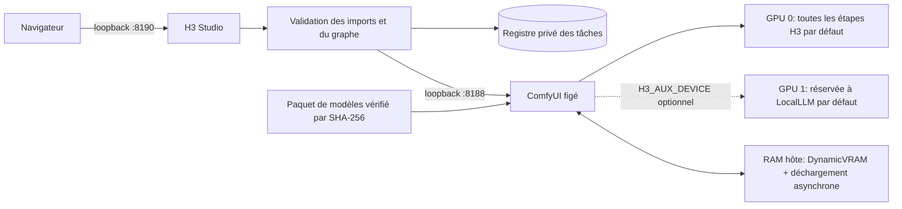

[English](../README.md) · [العربية](README.ar.md) · [Español](README.es.md) · [Français](README.fr.md) · [日本語](README.ja.md) · [한국어](README.ko.md) · [Tiếng Việt](README.vi.md) · [中文 (简体)](README.zh-Hans.md) · [中文（繁體）](README.zh-Hant.md) · [Deutsch](README.de.md) · [Русский](README.ru.md)

[](https://github.com/lachlanchen/lachlanchen/blob/main/figs/banner.png)

# LocalVideoGen

*Génération vidéo MiniMax H3 locale de qualité maximale pour une station à deux RTX 4090 — image, son et références natifs, avec une gestion rigoureuse des ressources.*

[](https://lazying.art)
[](../LICENSE)
[](../config/runtime-versions.txt)
[](../workflows/)
[](https://github.com/sponsors/lachlanchen)

LocalVideoGen est une couche d'exploitation reproductible autour d'une installation externe et figée de ComfyUI et du paquet officiel aligné MiniMax H3. Il fournit l'application web H3 Studio limitée au loopback, l'acquisition de modèles contrôlée par sommes de vérification, des workflows T2V/I2V/R2V, la génération native conjointe vidéo-audio, un historique persistant et des contrôles prudents du cycle de vie, réglés pour deux RTX 4090 de 24 GiB et 128 GiB de RAM hôte.

Pour une longue référence visuelle, utilisez **Long reference · 24 GiB safe** : `quality_int8_offload`, `match` et 704×1248 en portrait ou 1248×704 en paysage. Le contrôle d'admission vérifie dimensions et charge des références et bloque une tâche dangereuse avant son envoi au GPU.

| Donate | PayPal | Stripe |
| --- | --- | --- |
| [](https://chat.lazying.art/donate) | [](https://paypal.me/RongzhouChen) | [](https://buy.stripe.com/aFadR8gIaflgfQV6T4fw400) |

## H3 Studio en pratique

Le thème clair réunit lisiblement la préparation des références, les réglages de qualité et l'état du rendu dans un espace local unique.


## Créer une série vidéo

H3 Studio permet de passer de **Single Clip** à **Series** sans changer d'espace de travail. Le mode série propose **LALACHAN Series**, le préréglage **World Travel** qui privilégie la qualité et le préréglage neutre **My Movie** pour toute distribution ou direction visuelle.


- Importez une seule fois les références communes de personnages, univers, voix et mouvement, puis organisez de 2 à 12 cartes de plan modifiables avec leur propre prompt, durée et graine.
- **World Travel** verrouille les sept images canoniques de personnages et d'accessoires sur P1–P7, attribue à chaque plan sa propre planche de destination sur P8 et réserve P9 à l'image finale exacte du plan accepté précédent. Les épisodes antérieurs ne peuvent guider que l'identité ou la voix ; ils ne doivent orienter ni le nouveau pays, ni l'intrigue, ni la mise en scène, ni la palette, ni la composition.
- Une porte d'admission unique maintient tous les rendus H3 strictement séquentiels. Lorsque la continuité est activée, chaque plan non final validé fournit au suivant son image finale exacte et une fin configurée de 2 à 4 secondes (3 secondes par défaut).
- Mettez en pause après le plan courant, reprenez après un redémarrage, régénérez un plan et sa suite, ou relancez le post-traitement et l'assemblage final sans dépenser de GPU pour un MP4 déjà valide.
- Chaque tentative est conservée. Le film final n'est assemblé par copie de flux sans perte qu'après contrôle du nombre d'images attendu, de la moyenne déclarée de 24 fps, de l'alignement audio stéréo dans la tolérance AAC, du décodage intégral et du SHA-256 ; un manifeste de validation est également gardé.
- Les autres projets locaux et sessions Codex peuvent utiliser le client Series sans dépendance, fondé uniquement sur la Python stdlib. Il importe des références de taille bornée, vérifie les capacités du serveur, écrit atomiquement un reçu avec l'identifiant durable avant la génération, résiste aux pauses de validation et aux interruptions du polling, puis vérifie la taille et le SHA-256 d'un artefact avant d'installer le téléchargement.

Le parcours reprend la clarté du storyboard de Xiaoyunque, mais la génération et l'état du projet restent entièrement sur cette station via loopback. Aucun appel n'est envoyé à Xiaoyunque ni à un service cloud payant.

Consultez le [guide du workflow de série](../docs/series-workflow.md) pour la continuité et la reprise, le [guide de la Series API interprojets](../docs/local-series-api.md) pour le client/CLI stdlib et le contrat HTTP complet, ainsi que l'[étude des options pour des vidéos longues fluides](../docs/smooth-long-video-options.md) pour la base H3 native de confiance, les projets expérimentaux de continuité, l'interpolation facultative et les contrôles qualité.

## Fonctionnalités

- La fidélité BF16 maximale concerne une courte référence vidéo visuelle ou le R2V avec images seules ; les longues références vidéo utilisent par défaut la voie INT8/offload mesurée et sûre sur 24 Gio.
- Sur la station partagée, GPU 0 exécute par défaut toutes les étapes H3 et GPU 1 reste disponible pour LocalLLM. Seul `H3_AUX_DEVICE=gpu:1` explicite déplace Qwen et le VAE de référence vers GPU 1.
- T2V, I2V et R2V multiréférence en local, avec profil de fidélité d'identité maximale et audio natif synchronisé.
- Profils qualité, repli sur un seul GPU et aperçu INT8 Turbo en basse définition.
- H3 local produit jusqu'à 768 pixels sur le côté court à 24 fps. L'étape distincte de régénération 2K de MiniMax est réservée à l'API et n'est pas présentée comme locale.

## Architecture



L'application web ne lance jamais un second processus ComfyUI. Les services sont liés uniquement à `127.0.0.1` ; les imports sont normalisés en médias bornés, les identifiants visibles du navigateur sont opaques et les chemins de sortie sont autorisés explicitement.

## Contenu actuel

| Chemin | Rôle |
| --- | --- |
| [`webapp/`](../webapp/) | H3 Studio adaptatif, API locale, normalisation des imports, registre des tâches et tests |
| [`workflows/dual_gpu/`](../workflows/dual_gpu/) | Workflows BF16/INT8 T2V, I2V et R2V répartis par étapes |
| [`workflows/quality/`](../workflows/quality/) | Workflows qualité 25 étapes pour un seul GPU |
| [`workflows/preview/`](../workflows/preview/) | Petits workflows d'aperçu INT8 Turbo |
| [`scripts/`](../scripts/) | Outils de téléchargement, vérification, cycle de vie, ressources, smoke test et workflows |
| [`config/model-manifest.sha256`](../config/model-manifest.sha256) | Liste exacte des neuf fichiers autorisés et sommes SHA-256 |
| [`config/runtime-versions.txt`](../config/runtime-versions.txt) | Versions et commits figés du runtime externe |

Les volumineux `ComfyUI/`, `workflow_templates/`, poids, sorties, imports, bases de données et reçus d'exécution sont des installations locales ou des états privés/générés ; ils ne sont volontairement pas commités.

## Démarrage rapide

Ce dépôt est la couche publique d'orchestration, pas un installateur universel. Avant ces commandes, installez les copies externes `ComfyUI/` et `workflow_templates/` aux commits exacts indiqués dans [`config/runtime-versions.txt`](../config/runtime-versions.txt), créez `.venv` avec la pile Python/PyTorch/CUDA enregistrée et installez les dépendances ComfyUI upstream. Ces arbres ne sont volontairement pas intégrés.

La file complète des modèles officiels alignés représente **147 804 799 439 octets (137,65 GiB)**. Les téléchargements reprennent après interruption, mais prévoyez au moins 32 GiB d'espace libre en plus des données.

```bash
git clone https://github.com/lachlanchen/LocalVideoGen.git
cd LocalVideoGen

# Après installation du runtime externe figé :
./scripts/download_models.sh
./scripts/verify_models.sh
./scripts/status.sh

./scripts/start_comfyui.sh
./scripts/start_webapp.sh
```

Ouvrez <http://127.0.0.1:8190>. ComfyUI reste privé sur <http://127.0.0.1:8188>.

Lorsqu'aucun rendu n'est actif, arrêtez uniquement les processus vérifiés de ce projet :

```bash
./scripts/stop_webapp.sh
./scripts/stop_comfyui.sh
```

## Sécurité et contrôle des ressources

- Le démarrage exige 48 GiB de RAM disponible, 20 000 MiB libres sur chaque GPU demandé et une utilisation du swap inférieure ou égale à 75 %.
- Les téléchargements partiels ou les empreintes taille/mtime modifiées bloquent le démarrage ; les neuf fichiers sont contrôlés structurellement et vérifiés en SHA-256.
- PID, identité de démarrage, ligne de commande, propriétaire du listener, marqueur de service et état de file sont vérifiés avant toute action de cycle de vie.
- Le nettoyage GPU est un dry-run par défaut. Le nettoyage explicite emploie des pidfds précis et protège les arbres sous `LocalLLM` et `AgenticApp` ; aucun processus étranger n'est arrêté automatiquement.
- Le swap est une marge d'urgence, pas un substitut au seuil RAM. Un seul moteur de rendu et un Studio léger sont attendus pour ce projet.

## Validation

Générez et validez les workflows statiques, puis exécutez les tests web sans soumettre de rendu :

```bash
./scripts/prepare_workflows.py
./scripts/validate_workflows.py
.venv/bin/python -m unittest discover -s webapp/tests -v
./scripts/verify_models.sh
```

Avec les modèles vérifiés et le GPU 0 inactif, lancez le petit graphe de smoke test audio-vidéo natif :

```bash
H3_CUDA_DEVICES=0 ./scripts/start_comfyui.sh
./scripts/smoke_test.sh
H3_SMOKE_MODEL=minimax_h3_fl2va_pruned_bf16.safetensors ./scripts/smoke_test.sh
./scripts/stop_comfyui.sh
```

La sortie de cinq images vérifie le conditionnement Qwen, l'échantillonnage conjoint vidéo/audio, les deux VAE, le multiplexage MP4 et le décodage des flux ; ce n'est pas un benchmark de qualité visuelle.

## Licence et territoire du modèle

Le code et la documentation originaux de LocalVideoGen sont publiés sous [MIT License](../LICENSE). Cette licence **ne relicencie pas** ComfyUI, workflow templates, les poids MiniMax H3, les composants Qwen, FFmpeg, les autres dépendances upstream ou les ressources générées. Chacun conserve ses propres conditions.

Aucun conditionneur jailbroken ou abliterated n'est inclus : le manifeste n'accepte que le fichier aligné Comfy-Org `qwen3vl_32b_minimax_h3_nvfp4_awq.safetensors` avec la somme enregistrée. La MiniMax H3 Community License exclut l'UE, le Royaume-Uni, la République de Corée et les États-Unis de son territoire applicable et impose des obligations de redistribution. Consultez la [fiche upstream](https://huggingface.co/MiniMaxAI/MiniMax-H3), la [licence](https://huggingface.co/MiniMaxAI/MiniMax-H3/blob/main/LICENSE), le droit applicable et les licences des dépendances avant tout téléchargement ou usage. Ce projet ne fournit aucun conseil juridique.

## Citation

Si vous utilisez LocalVideoGen en recherche, citez ce dépôt. GitHub lit [CITATION.cff](../CITATION.cff) et affiche le panneau **Cite this repository** sur la page du dépôt.

```bibtex
@software{chen_localvideogen_2026,
  author = {Chen, Lachlan},
  title = {LocalVideoGen: Resource-Aware Local MiniMax H3 Video Generation},
  year = {2026},
  version = {0.1.0},
  url = {https://github.com/lachlanchen/LocalVideoGen}
}
```

## État et périmètre

La version **0.1.0** est une publication de recherche centrée sur cette station, validée sous Linux avec deux RTX 4090 et 128 GiB de RAM. Elle privilégie la reproductibilité, l'intégrité des modèles, la qualité visuelle et la coexistence sûre avec d'autres projets de longue durée plutôt qu'une prise en charge matérielle générale ou une installation en un clic. Les résultats restent génératifs et doivent être examinés avant publication.

Projet : [github.com/lachlanchen/LocalVideoGen](https://github.com/lachlanchen/LocalVideoGen) · Site : [lazying.art](https://lazying.art)
