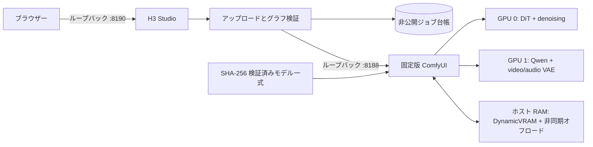

[English](../README.md) · [العربية](README.ar.md) · [Español](README.es.md) · [Français](README.fr.md) · [日本語](README.ja.md) · [한국어](README.ko.md) · [Tiếng Việt](README.vi.md) · [中文 (简体)](README.zh-Hans.md) · [中文（繁體）](README.zh-Hant.md) · [Deutsch](README.de.md) · [Русский](README.ru.md)

[](https://github.com/lachlanchen/lachlanchen/blob/main/figs/banner.png)

# LocalVideoGen

*デュアル RTX 4090 ワークステーションで最高品質の MiniMax H3 動画をローカル生成——ネイティブ映像・音声・参照素材と、慎重なリソース所有権管理。*

[](https://lazying.art)
[](../LICENSE)
[](../config/runtime-versions.txt)
[](../workflows/)
[](https://github.com/sponsors/lachlanchen)

LocalVideoGen は、バージョン固定された外部 ComfyUI 環境と公式のアライン済み MiniMax H3 モデルパッケージを扱う再現可能な運用レイヤーです。ループバック限定の H3 Studio ウェブアプリ、チェックサムを通過したモデル取得、T2V/I2V/R2V ワークフロー、映像・音声のネイティブ同時生成、永続ジョブ履歴、そして 24 GiB RTX 4090 2基とホスト RAM 128 GiB 向けの保守的なライフサイクル制御を備えます。

| Donate | PayPal | Stripe |
| --- | --- | --- |
| [](https://chat.lazying.art/donate) | [](https://paypal.me/RongzhouChen) | [](https://buy.stripe.com/aFadR8gIaflgfQV6T4fw400) |

## H3 Studio 画面

ライトテーマでは、参照素材の設定、品質調整、レンダー状況を一つのローカル作業画面で明瞭に確認できます。


## 動画シリーズを作る

H3 Studio 内で **Single Clip** と **Series** を切り替えられます。シリーズモードには、キャラクターと小道具用の名前付き7枠を備えた **LALACHAN Series** プリセットと、任意の登場人物・映像スタイルに使える中立的な **My Movie** プリセットがあります。


- キャスト、世界観、声、動きの共通参照を一度だけアップロードし、個別のプロンプト・尺・シードを持つ2～12枚のショットカードを編集・並べ替えできます。
- 共通の受付ゲートにより、H3レンダーは常に1本ずつ順番に実行されます。連続性を有効にすると、検証済みの最終以外のショットから、正確な最終フレームと設定した2～4秒の末尾（既定は3秒）が次のショットへ渡されます。
- 現在のショット後に一時停止し、再起動後に再開できます。特定ショット以降の再生成や、既に有効なMP4を再生成せずに後処理・最終結合だけを再試行することもできます。
- すべての生成試行を保持します。想定フレーム数、報告された平均24 fps、AAC許容範囲内のステレオ音声同期、完全デコード、SHA-256を確認した後にのみ、無劣化のストリームコピーで最終動画を結合し、検証マニフェストも保存します。

操作の分かりやすさは Xiaoyunque のストーリーボード体験を参考にしていますが、生成とプロジェクト状態は loopback 経由でこのワークステーション内に留まります。Xiaoyunque や有料クラウド生成サービスは呼び出しません。

## 提供する機能

- 最高品質プリセット：pruned BF16 Ref2VA/FL2VA DiT、アライン済み NVFP4-AWQ Qwen3-VL conditioner、FP16 video VAE、FP32 audio VAE、フルモデル 25 ステップ。
- デュアル GPU のステージ配置：GPU 0 が DiT と denoiser、GPU 1 が Qwen conditioning と video/audio VAE を担当します。PCIe peer-to-peer 経路は前提にしません。
- ローカル T2V、I2V、複数参照 R2V。max-identity 参照プリセットとネイティブ同期音声を含みます。
- 品質重視、単一 GPU フォールバック、低解像度 INT8 Turbo プレビューの各プロファイル。
- ローカル H3 は 24 fps、短辺最大 768 px。MiniMax の別工程である 2K 再生成は API 限定であり、ローカル機能として扱いません。

## アーキテクチャ



ウェブアプリが 2 つ目の ComfyUI プロセスを起動することはありません。サービスは `127.0.0.1` のみに bind し、アップロードは制限付きメディアへ正規化され、ブラウザーには不透明な識別子のみを返し、出力パスは allowlist で制限します。

## 現在の内容

| パス | 用途 |
| --- | --- |
| [`webapp/`](../webapp/) | レスポンシブ H3 Studio、ローカル API、アップロード正規化、ジョブ台帳、テスト |
| [`workflows/dual_gpu/`](../workflows/dual_gpu/) | BF16/INT8 T2V・I2V・R2V ステージ配置ワークフロー |
| [`workflows/quality/`](../workflows/quality/) | 単一 GPU の 25 ステップ品質ワークフロー |
| [`workflows/preview/`](../workflows/preview/) | 小規模 INT8 Turbo プレビューワークフロー |
| [`scripts/`](../scripts/) | ダウンロード、検証、ライフサイクル、リソース、スモークテスト、ワークフローツール |
| [`config/model-manifest.sha256`](../config/model-manifest.sha256) | 9ファイルの厳密なモデル allowlist と SHA-256 チェックサム |
| [`config/runtime-versions.txt`](../config/runtime-versions.txt) | 固定された外部ランタイムの版とコミット |

大容量の `ComfyUI/`、`workflow_templates/`、モデル重み、出力、アップロード、データベース、ランタイム証明はローカル導入物または非公開・生成状態であり、意図的にコミットしません。

## クイックスタート

このリポジトリは公開オーケストレーション層であり、汎用インストーラーではありません。次のコマンドの前に、[`config/runtime-versions.txt`](../config/runtime-versions.txt) 記載の正確なコミットで外部 `ComfyUI/` と `workflow_templates/` を配置し、記録された Python/PyTorch/CUDA 構成で `.venv` を作成し、上流 ComfyUI の依存関係を導入してください。上流ツリーは意図的に同梱していません。

公式アライン済みモデルの完全なキューは **147,804,799,439 bytes（137.65 GiB）** です。再開可能ですが、モデル容量に加えて最低 32 GiB の空き領域を確保してください。

```bash
git clone https://github.com/lachlanchen/LocalVideoGen.git
cd LocalVideoGen

# 固定版の外部ランタイムを導入した後：
./scripts/download_models.sh
./scripts/verify_models.sh
./scripts/status.sh

./scripts/start_comfyui.sh
./scripts/start_webapp.sh
```

<http://127.0.0.1:8190> を開きます。ComfyUI は <http://127.0.0.1:8188> で非公開のままです。

レンダーが動いていないときだけ、本プロジェクトが検証したプロセスを停止します。

```bash
./scripts/stop_webapp.sh
./scripts/stop_comfyui.sh
```

## 安全性とリソース制御

- 起動には、利用可能 RAM 48 GiB 以上、要求する各 GPU の空き VRAM 20,000 MiB 以上、swap 使用率 75% 以下が必要です。
- 不完全なモデルダウンロードや、サイズ・mtime 指紋が変わったモデルは起動を阻止します。9ファイルすべてを構造検査し、SHA-256 で照合します。
- ライフサイクル操作前に PID、boot identity、コマンドライン、listener 所有権、service marker、queue 状態を検証します。
- GPU クリーンアップは既定で dry-run です。明示的なクリーンアップは正確な pidfd を使い、`LocalLLM` と `AgenticApp` 配下のプロセスツリーを保護します。他プロジェクトのプロセスを自動停止しません。
- swap は緊急用余裕であり、RAM 起動条件の代替ではありません。本プロジェクトではレンダーエンジン 1 個と軽量 Studio 1 個のみを想定します。

## 検証

レンダーを投入せず、静的ワークフロー生成・検証とウェブアプリテストを実行できます。

```bash
./scripts/prepare_workflows.py
./scripts/validate_workflows.py
.venv/bin/python -m unittest discover -s webapp/tests -v
./scripts/verify_models.sh
```

モデル検証済みで GPU 0 がアイドルなら、小さなネイティブ音声・動画スモークグラフを実行できます。

```bash
H3_CUDA_DEVICES=0 ./scripts/start_comfyui.sh
./scripts/smoke_test.sh
H3_SMOKE_MODEL=minimax_h3_fl2va_pruned_bf16.safetensors ./scripts/smoke_test.sh
./scripts/stop_comfyui.sh
```

5フレームの出力は Qwen conditioning、映像・音声の同時 sampling、両 VAE、MP4 mux、stream decode を検証します。視覚品質のベンチマークではありません。

## ライセンスとモデルの適用地域

LocalVideoGen 独自のコードと文書は [MIT License](../LICENSE) で公開します。このライセンスは ComfyUI、workflow templates、MiniMax H3 weights、Qwen components、FFmpeg、その他の上流依存物や生成素材を**再ライセンスしません**。それぞれ元の条件が維持されます。

jailbreak/abliterated conditioner は含みません。manifest が受理するのは、記録済みチェックサムに一致するアライン済み Comfy-Org `qwen3vl_32b_minimax_h3_nvfp4_awq.safetensors` のみです。MiniMax H3 Community License は EU、英国、大韓民国、米国を適用地域から除外し、再配布義務も定めています。重みを取得・利用する前に、[上流モデルカード](https://huggingface.co/MiniMaxAI/MiniMax-H3)、[ライセンス](https://huggingface.co/MiniMaxAI/MiniMax-H3/blob/main/LICENSE)、適用法、各依存物のライセンスを確認してください。本プロジェクトは法的助言を提供しません。

## 引用

研究で LocalVideoGen を利用する場合は、このリポジトリを引用してください。GitHub は [CITATION.cff](../CITATION.cff) を読み込み、リポジトリページに **Cite this repository** パネルを表示します。

```bibtex
@software{chen_localvideogen_2026,
  author = {Chen, Lachlan},
  title = {LocalVideoGen: Resource-Aware Local MiniMax H3 Video Generation},
  year = {2026},
  version = {0.1.0},
  url = {https://github.com/lachlanchen/LocalVideoGen}
}
```

## 状態と対象範囲

バージョン **0.1.0** はワークステーション向けの研究リリースで、RTX 4090 2基と RAM 128 GiB を備えた Linux 環境で検証済みです。広範なハードウェア対応やワンクリック導入よりも、再現性、モデル完全性、視覚品質、長時間稼働する他プロジェクトとの安全な共存を優先します。結果は生成物であるため、公開前に確認してください。

プロジェクト：[github.com/lachlanchen/LocalVideoGen](https://github.com/lachlanchen/LocalVideoGen) · ホームページ：[lazying.art](https://lazying.art)
