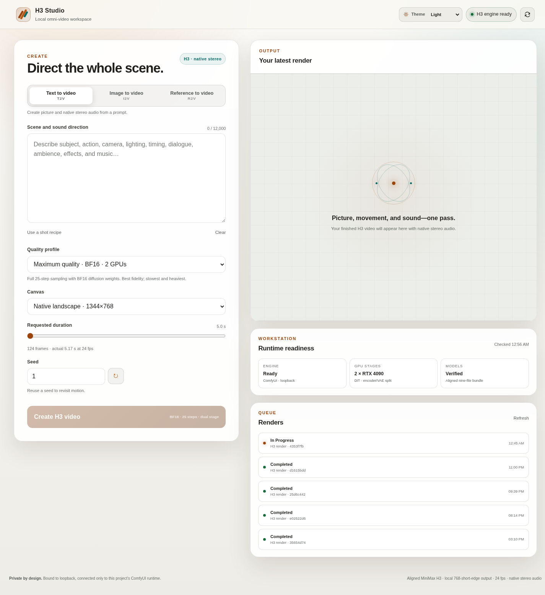
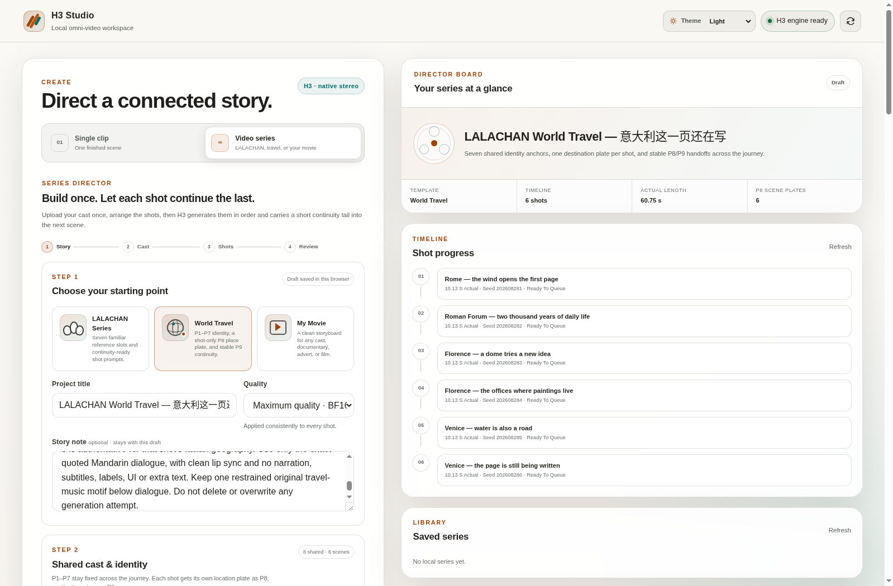
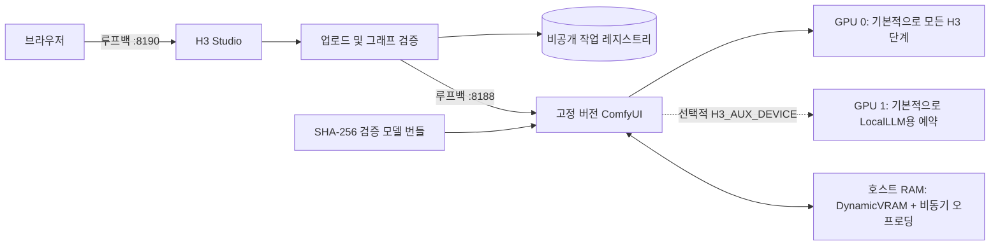

[English](../README.md) · [العربية](README.ar.md) · [Español](README.es.md) · [Français](README.fr.md) · [日本語](README.ja.md) · [한국어](README.ko.md) · [Tiếng Việt](README.vi.md) · [中文 (简体)](README.zh-Hans.md) · [中文（繁體）](README.zh-Hant.md) · [Deutsch](README.de.md) · [Русский](README.ru.md)

[](https://github.com/lachlanchen/lachlanchen/blob/main/figs/banner.png)

# LocalVideoGen

*듀얼 RTX 4090 워크스테이션을 위한 최고 품질의 로컬 MiniMax H3 영상 생성—네이티브 영상·음성·참조 자료와 신중한 리소스 소유권 관리.*

[](https://lazying.art)
[](../LICENSE)
[](../config/runtime-versions.txt)
[](../workflows/)
[](https://github.com/sponsors/lachlanchen)

LocalVideoGen은 버전이 고정된 외부 ComfyUI 설치와 공식 정렬 MiniMax H3 모델 패키지를 감싸는 재현 가능한 운영 계층입니다. 루프백 전용 H3 Studio 웹앱, 체크섬을 통과한 모델 다운로드, T2V/I2V/R2V 워크플로 프리셋, 네이티브 영상·음성 공동 생성, 영구 작업 기록, 그리고 24 GiB RTX 4090 두 장과 128 GiB 호스트 RAM에 맞춘 보수적 수명주기 제어를 제공합니다.

긴 시각 참조에는 **Long reference · 24 GiB safe** 프리셋을 사용하세요: `quality_int8_offload`, `match`, 세로 704×1248 또는 가로 1248×704입니다. 제출 전 가드가 크기와 참조 부하를 검사하고 안전 한도를 넘는 작업을 GPU로 보내기 전에 거부합니다.

| Donate | PayPal | Stripe |
| --- | --- | --- |
| [](https://chat.lazying.art/donate) | [](https://paypal.me/RongzhouChen) | [](https://buy.stripe.com/aFadR8gIaflgfQV6T4fw400) |

## H3 Studio 화면

라이트 테마는 참조 설정, 품질 제어, 렌더 상태를 하나의 로컬 작업 공간에서 선명하게 보여 줍니다.



## 비디오 시리즈 만들기

H3 Studio를 벗어나지 않고 **Single Clip**과 **Series**를 전환할 수 있습니다. 시리즈 모드는 **LALACHAN Series**, 품질 우선 **World Travel** 프리셋, 어떤 출연진이나 영상 스타일에도 쓸 수 있는 중립적인 **My Movie** 프리셋을 제공합니다.



- 출연진, 세계관, 음성, 동작의 공용 참조를 한 번만 업로드한 뒤, 각각의 프롬프트·길이·시드를 가진 2~12개 쇼트 카드를 편집하고 재배열합니다.
- **World Travel**은 표준 캐릭터·소품 이미지 7장을 P1–P7에 고정하고, 각 쇼트의 목적지 장면 이미지를 P8에 배치하며, 직전에 승인된 쇼트의 정확한 마지막 프레임을 위해 P9를 예약합니다. 이전 에피소드는 정체성이나 음성만 참조할 수 있으며 새 국가, 줄거리, 블로킹, 색상 팔레트, 구도를 좌우할 수 없습니다.
- 하나의 공용 승인 게이트가 모든 H3 렌더를 엄격히 순차 실행합니다. 연속성을 켜면 검증된 비최종 쇼트의 정확한 마지막 프레임과 설정한 2~4초 꼬리 구간(기본 3초)이 다음 쇼트로 전달됩니다.
- 현재 쇼트 뒤에 일시 정지하고 재시작 후 계속할 수 있습니다. 특정 쇼트와 후속 쇼트를 다시 만들거나, 이미 유효한 MP4에 GPU를 다시 쓰지 않고 후처리와 최종 결합만 재시도할 수 있습니다.
- 모든 렌더 시도를 보존합니다. 예상 프레임 수, 보고된 평균 24 fps, AAC 허용 범위 내 스테레오 오디오 정렬, 전체 디코드, SHA-256 검사를 통과한 뒤에만 무손실 스트림 복사로 최종 영화를 결합하며 검증 매니페스트도 함께 남깁니다.
- 다른 로컬 프로젝트와 Codex 세션에서는 Python stdlib만 사용하는 무의존성 Series 클라이언트를 이용할 수 있습니다. 제한된 크기의 참조를 업로드하고 서버 기능을 검증하며, 생성 전에 영구 ID 영수증을 원자적으로 기록합니다. 검토 일시 정지와 폴링 중단에도 복구할 수 있고, 다운로드를 설치하기 전에 아티팩트의 크기와 SHA-256을 검증합니다.

작업 흐름은 Xiaoyunque 스토리보드의 명료함에서 영감을 받았지만 생성과 프로젝트 상태는 loopback을 통해 이 워크스테이션 안에만 유지됩니다. Xiaoyunque나 유료 클라우드 생성 서비스를 호출하지 않습니다.

연속성과 복구 동작은 [시리즈 워크플로 가이드](../docs/series-workflow.md), stdlib CLI/클라이언트와 전체 HTTP 계약은 [프로젝트 간 Series API 가이드](../docs/local-series-api.md), 신뢰할 수 있는 네이티브 H3 기준선·실험적 연속성 프로젝트·선택적 보간·품질 게이트는 [매끄러운 장편 비디오 옵션 검토](../docs/smooth-long-video-options.md)를 참조하세요.

## 제공 기능

- BF16 최고 충실도는 짧은 시각 비디오 참조 또는 이미지만 쓰는 R2V용입니다. 긴 비디오 참조는 측정된 24 GiB 안전 INT8/offload 경로를 기본으로 사용합니다.
- 공유 워크스테이션에서는 GPU 0이 기본적으로 모든 H3 단계를 실행하고 GPU 1은 LocalLLM용으로 비워 둡니다. 명시적인 `H3_AUX_DEVICE=gpu:1`만 Qwen과 참조 VAE를 GPU 1로 옮깁니다.
- max-identity 참조 프리셋과 네이티브 동기화 음성을 포함한 로컬 T2V, I2V, 다중 참조 R2V.
- 품질, 단일 GPU 대체, 저해상도 INT8 Turbo 미리보기 프로필.
- 로컬 H3 출력은 24 fps에서 짧은 변 최대 768 px입니다. MiniMax의 별도 2K 재생성 단계는 API 전용이며 로컬 기능으로 제시하지 않습니다.

## 아키텍처



웹앱은 두 번째 ComfyUI 프로세스를 시작하지 않습니다. 서비스는 `127.0.0.1`에만 바인딩되며, 업로드는 제한된 미디어로 정규화되고, 브라우저에는 불투명 식별자만 제공되며, 출력 경로는 허용 목록으로 제한됩니다.

## 현재 구성

| 경로 | 용도 |
| --- | --- |
| [`webapp/`](../webapp/) | 반응형 H3 Studio, 로컬 API, 업로드 정규화, 작업 레지스트리, 테스트 |
| [`workflows/dual_gpu/`](../workflows/dual_gpu/) | BF16/INT8 T2V, I2V, R2V 단계 배치 워크플로 |
| [`workflows/quality/`](../workflows/quality/) | 단일 GPU 25단계 품질 워크플로 |
| [`workflows/preview/`](../workflows/preview/) | 소형 INT8 Turbo 미리보기 워크플로 |
| [`scripts/`](../scripts/) | 다운로드, 검증, 수명주기, 리소스, 스모크 테스트, 워크플로 도구 |
| [`config/model-manifest.sha256`](../config/model-manifest.sha256) | 정확한 9개 모델 파일 허용 목록과 SHA-256 체크섬 |
| [`config/runtime-versions.txt`](../config/runtime-versions.txt) | 고정된 외부 런타임 버전과 커밋 |

용량이 큰 `ComfyUI/`, `workflow_templates/`, 모델 가중치, 출력, 업로드, 데이터베이스, 런타임 영수증은 로컬 설치 또는 비공개/생성 상태이므로 의도적으로 커밋하지 않습니다.

## 빠른 시작

이 저장소는 공개 오케스트레이션 계층이지 범용 설치 관리자가 아닙니다. 아래 명령을 사용하기 전에 [`config/runtime-versions.txt`](../config/runtime-versions.txt)의 정확한 커밋으로 외부 `ComfyUI/`와 `workflow_templates/` 작업 복사본을 설치하고, 기록된 Python/PyTorch/CUDA 스택으로 `.venv`를 만든 뒤, 상류 ComfyUI 요구 사항을 설치하십시오. 상류 트리는 의도적으로 포함하지 않습니다.

공식 정렬 모델 전체 대기열은 **147,804,799,439 bytes(137.65 GiB)**입니다. 다운로드는 재개할 수 있지만 모델 데이터 외에 최소 32 GiB 여유 공간을 확보하십시오.

```bash
git clone https://github.com/lachlanchen/LocalVideoGen.git
cd LocalVideoGen

# 고정 버전 외부 런타임 설치 후:
./scripts/download_models.sh
./scripts/verify_models.sh
./scripts/status.sh

./scripts/start_comfyui.sh
./scripts/start_webapp.sh
```

<http://127.0.0.1:8190>을 여십시오. ComfyUI는 <http://127.0.0.1:8188>에서 비공개로 유지됩니다.

활성 렌더가 없을 때 이 프로젝트가 검증한 프로세스만 중지하십시오.

```bash
./scripts/stop_webapp.sh
./scripts/stop_comfyui.sh
```

## 안전 및 리소스 제어

- 시작 시 사용 가능한 RAM 48 GiB 이상, 요청한 각 GPU의 여유 VRAM 20,000 MiB 이상, swap 사용률 75% 이하가 필요합니다.
- 불완전한 모델 다운로드나 변경된 크기/mtime 지문은 시작을 차단합니다. 9개 파일 모두 구조 검사와 SHA-256 검증을 거칩니다.
- 수명주기 작업 전에 PID, 부팅 신원, 명령줄, 리스너 소유권, 서비스 마커, 대기열 상태를 확인합니다.
- GPU 정리는 기본적으로 dry-run입니다. 명시적 정리는 정확한 pidfd를 사용하며 `LocalLLM`과 `AgenticApp` 아래의 프로세스 트리를 보호합니다. 외부 프로세스를 자동으로 중지하지 않습니다.
- swap은 비상 여유 공간일 뿐 RAM 시작 기준을 대신하지 않습니다. 이 프로젝트에는 렌더 엔진 하나와 가벼운 Studio 하나만 있어야 합니다.

## 검증

렌더를 제출하지 않고 정적 워크플로 생성·검증과 웹앱 테스트를 실행합니다.

```bash
./scripts/prepare_workflows.py
./scripts/validate_workflows.py
.venv/bin/python -m unittest discover -s webapp/tests -v
./scripts/verify_models.sh
```

모델이 검증되고 GPU 0이 유휴 상태일 때 작은 네이티브 음성·영상 스모크 그래프를 실행합니다.

```bash
H3_CUDA_DEVICES=0 ./scripts/start_comfyui.sh
./scripts/smoke_test.sh
H3_SMOKE_MODEL=minimax_h3_fl2va_pruned_bf16.safetensors ./scripts/smoke_test.sh
./scripts/stop_comfyui.sh
```

5프레임 스모크 출력은 Qwen conditioning, 영상·음성 공동 sampling, 두 VAE, MP4 mux, stream decode 가능 여부를 검사합니다. 시각 품질 벤치마크는 아닙니다.

## 라이선스와 모델 적용 지역

LocalVideoGen의 원본 코드와 문서는 [MIT License](../LICENSE)로 공개됩니다. 이 라이선스는 ComfyUI, workflow templates, MiniMax H3 weights, Qwen components, FFmpeg, 기타 상류 의존성 또는 생성 자산을 **재라이선스하지 않습니다**. 각각의 기존 조건이 유지됩니다.

jailbreak 또는 abliterated conditioner는 포함하지 않습니다. manifest는 기록된 체크섬과 일치하는 정렬된 Comfy-Org `qwen3vl_32b_minimax_h3_nvfp4_awq.safetensors`만 허용합니다. MiniMax H3 Community License는 EU, 영국, 대한민국, 미국을 적용 지역에서 제외하며 재배포 의무도 부과합니다. 가중치를 다운로드하거나 사용하기 전에 [상류 모델 카드](https://huggingface.co/MiniMaxAI/MiniMax-H3), [라이선스](https://huggingface.co/MiniMaxAI/MiniMax-H3/blob/main/LICENSE), 적용 법률, 모든 의존성 라이선스를 검토하십시오. 이 프로젝트는 법률 자문을 제공하지 않습니다.

## 인용

연구에서 LocalVideoGen을 사용한다면 이 저장소를 인용해 주십시오. GitHub는 [CITATION.cff](../CITATION.cff)를 읽어 저장소 페이지에 **Cite this repository** 패널을 표시합니다.

```bibtex
@software{chen_localvideogen_2026,
  author = {Chen, Lachlan},
  title = {LocalVideoGen: Resource-Aware Local MiniMax H3 Video Generation},
  year = {2026},
  version = {0.1.0},
  url = {https://github.com/lachlanchen/LocalVideoGen}
}
```

## 상태와 범위

버전 **0.1.0**은 워크스테이션 중심 연구 릴리스이며 RTX 4090 두 장과 RAM 128 GiB를 갖춘 Linux에서 검증되었습니다. 폭넓은 하드웨어 지원이나 원클릭 설치보다 재현성, 모델 무결성, 시각 품질, 장기 실행 중인 다른 프로젝트와의 안전한 공존을 우선합니다. 결과물은 생성형이므로 게시 전에 검토해야 합니다.

프로젝트: [github.com/lachlanchen/LocalVideoGen](https://github.com/lachlanchen/LocalVideoGen) · 홈페이지: [lazying.art](https://lazying.art)
