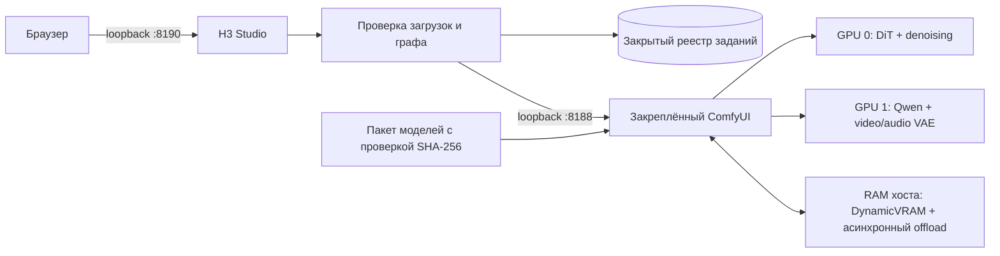

[English](../README.md) · [العربية](README.ar.md) · [Español](README.es.md) · [Français](README.fr.md) · [日本語](README.ja.md) · [한국어](README.ko.md) · [Tiếng Việt](README.vi.md) · [中文 (简体)](README.zh-Hans.md) · [中文（繁體）](README.zh-Hant.md) · [Deutsch](README.de.md) · [Русский](README.ru.md)

[](https://github.com/lachlanchen/lachlanchen/blob/main/figs/banner.png)

# LocalVideoGen

*Локальная генерация видео MiniMax H3 максимального качества для рабочей станции с двумя RTX 4090 — нативные изображение, звук и референсы при аккуратном владении ресурсами.*

[](https://lazying.art)
[](../LICENSE)
[](../config/runtime-versions.txt)
[](../workflows/)
[](https://github.com/sponsors/lachlanchen)

LocalVideoGen — воспроизводимый операционный слой поверх внешней закреплённой установки ComfyUI и официального выровненного пакета MiniMax H3. Он предоставляет доступное только через loopback веб-приложение H3 Studio, загрузку моделей с обязательной проверкой контрольных сумм, процессы T2V/I2V/R2V, совместную нативную генерацию видео и звука, постоянную историю заданий и консервативное управление жизненным циклом для двух RTX 4090 по 24 GiB и 128 GiB оперативной памяти.

| Donate | PayPal | Stripe |
| --- | --- | --- |
| [](https://chat.lazying.art/donate) | [](https://paypal.me/RongzhouChen) | [](https://buy.stripe.com/aFadR8gIaflgfQV6T4fw400) |

## Интерфейс H3 Studio

Светлая тема ясно объединяет настройку референсов, параметры качества и состояние рендера в одном локальном рабочем пространстве.


## Создание видеосерии

В H3 Studio можно переключаться между **Single Clip** и **Series**, не покидая рабочее пространство. Режим серии предлагает **LALACHAN Series**, ориентированный на качество шаблон **World Travel** и нейтральный **My Movie** для любого состава и визуального стиля.


- Общие референсы персонажей, мира, голосов и движения загружаются один раз; затем можно расположить от 2 до 12 редактируемых карточек кадров с отдельными промптами, длительностью и seed.
- **World Travel** закрепляет семь канонических изображений персонажей и реквизита за P1–P7, помещает отдельный референс места назначения каждого кадра в P8 и резервирует P9 для точного последнего кадра предыдущего принятого фрагмента. Более ранние эпизоды могут задавать только идентичность или голос; они не должны направлять новую страну, сюжет, мизансцену, палитру или композицию.
- Единый шлюз допуска обеспечивает строго последовательный рендер H3. Когда непрерывность включена, каждый проверенный не последний кадр передаёт следующему точный финальный кадр и настроенный хвост длиной 2–4 секунды (по умолчанию 3 секунды).
- Можно поставить процесс на паузу после текущего кадра, продолжить после перезапуска, повторить кадр и всё после него либо заново выполнить постобработку и финальную сборку, не расходуя GPU на уже корректный MP4.
- Сохраняется каждая попытка. Итоговый фильм собирается без потерь копированием потоков только после проверки ожидаемого числа кадров, заявленного среднего значения 24 fps, синхронизации стереозвука в пределах допуска AAC, полного декодирования и SHA-256; рядом сохраняется манифест проверки.
- Другие локальные проекты и сеансы Codex могут использовать не требующий зависимостей клиент Series, основанный только на Python stdlib. Он загружает референсы с ограничением размера, проверяет возможности сервера, атомарно записывает квитанцию с постоянным идентификатором до начала генерации, выдерживает паузы проверки и прерывания опроса, а перед установкой загрузки сверяет размер и SHA-256 артефакта.

Процесс вдохновлён ясностью раскадровки Xiaoyunque, но генерация и состояние проекта остаются на этой рабочей станции через loopback. Вызовов Xiaoyunque или платных облачных генераторов нет.

Подробнее о непрерывности и восстановлении см. в [руководстве по процессу серий](../docs/series-workflow.md), о stdlib CLI/клиенте и полном контракте HTTP — в [руководстве по Series API для разных проектов](../docs/local-series-api.md), а о проверенной нативной основе H3, экспериментальных проектах непрерывности, необязательной интерполяции и контроле качества — в [обзоре способов сделать длинное видео плавнее](../docs/smooth-long-video-options.md).

## Возможности

- Профиль максимального качества: сокращённый BF16 Ref2VA/FL2VA DiT, выровненный NVFP4-AWQ Qwen3-VL conditioner, FP16 video VAE, FP32 audio VAE и 25 полных шагов модели.
- Поэтапное размещение на двух GPU: GPU 0 выполняет DiT и denoising; GPU 1 — Qwen conditioning и video/audio VAE. Наличие PCIe peer-to-peer не предполагается.
- Локальные T2V, I2V и многоопорный R2V, включая профиль максимального сохранения идентичности и нативный синхронный звук.
- Профили качества, резервный режим одной GPU и низкоразрешённый предпросмотр INT8 Turbo.
- Локальный H3 выдаёт до 768 пикселей по короткой стороне при 24 fps. Отдельный этап регенерации MiniMax в 2K доступен только через API и не заявляется локальной функцией.

## Архитектура



Веб-приложение никогда не запускает второй процесс ComfyUI. Сервисы привязаны только к `127.0.0.1`; загружаемые файлы нормализуются в ограниченные медиа, браузер видит непрозрачные идентификаторы, а выходные пути разрешены явным списком.

## Текущее содержимое

| Путь | Назначение |
| --- | --- |
| [`webapp/`](../webapp/) | Адаптивный H3 Studio, локальный API, нормализация загрузок, реестр заданий и тесты |
| [`workflows/dual_gpu/`](../workflows/dual_gpu/) | Поэтапные процессы BF16/INT8 T2V, I2V и R2V |
| [`workflows/quality/`](../workflows/quality/) | 25-шаговые процессы качества для одной GPU |
| [`workflows/preview/`](../workflows/preview/) | Малые процессы предпросмотра INT8 Turbo |
| [`scripts/`](../scripts/) | Загрузка, проверка, жизненный цикл, ресурсы, smoke-тест и инструменты процессов |
| [`config/model-manifest.sha256`](../config/model-manifest.sha256) | Точный список разрешённых девяти файлов и суммы SHA-256 |
| [`config/runtime-versions.txt`](../config/runtime-versions.txt) | Закреплённые версии и коммиты внешней среды |

Крупные `ComfyUI/`, `workflow_templates/`, веса, результаты, загрузки, базы данных и квитанции среды являются локальными установками либо закрытым/сгенерированным состоянием и намеренно не коммитятся.

## Быстрый запуск

Этот репозиторий — публичный слой оркестрации, а не универсальный установщик. Перед командами установите внешние рабочие копии `ComfyUI/` и `workflow_templates/` на точных коммитах из [`config/runtime-versions.txt`](../config/runtime-versions.txt), создайте `.venv` с указанным стеком Python/PyTorch/CUDA и установите зависимости upstream ComfyUI. Исходные деревья намеренно не включены.

Полная очередь официальных выровненных моделей занимает **147 804 799 439 байт (137,65 GiB)**. Загрузки возобновляемы; сверх веса моделей нужно не менее 32 GiB свободного места.

```bash
git clone https://github.com/lachlanchen/LocalVideoGen.git
cd LocalVideoGen

# После установки закреплённой внешней среды:
./scripts/download_models.sh
./scripts/verify_models.sh
./scripts/status.sh

./scripts/start_comfyui.sh
./scripts/start_webapp.sh
```

Откройте <http://127.0.0.1:8190>. ComfyUI остаётся закрытым на <http://127.0.0.1:8188>.

Когда рендер не выполняется, останавливайте только проверенные процессы этого проекта:

```bash
./scripts/stop_webapp.sh
./scripts/stop_comfyui.sh
```

## Безопасность и управление ресурсами

- Для запуска требуется не менее 48 GiB доступной RAM, 20 000 MiB свободной VRAM на каждой запрошенной GPU и не более 75 % занятого swap.
- Частичные загрузки и изменение отпечатка размер/mtime блокируют запуск; все девять файлов проходят структурную проверку и SHA-256.
- Перед действиями проверяются PID, идентичность загрузки, командная строка, владелец listener, маркер сервиса и очередь.
- Очистка GPU по умолчанию работает как dry-run. Явная очистка использует точные pidfd и защищает деревья `LocalLLM` и `AgenticApp`; чужие процессы автоматически не завершаются.
- Swap — аварийный резерв, не замена порогу RAM. Проект предполагает один движок рендера и один лёгкий Studio.

## Проверка

Статические процессы и тесты веб-приложения запускаются без постановки рендера:

```bash
./scripts/prepare_workflows.py
./scripts/validate_workflows.py
.venv/bin/python -m unittest discover -s webapp/tests -v
./scripts/verify_models.sh
```

С проверенными моделями и свободной GPU 0 запустите малый нативный аудиовизуальный smoke-граф:

```bash
H3_CUDA_DEVICES=0 ./scripts/start_comfyui.sh
./scripts/smoke_test.sh
H3_SMOKE_MODEL=minimax_h3_fl2va_pruned_bf16.safetensors ./scripts/smoke_test.sh
./scripts/stop_comfyui.sh
```

Пятикадровый результат проверяет Qwen conditioning, совместный video/audio sampling, оба VAE, MP4 mux и декодирование потоков; это не тест визуального качества.

## Лицензия и территория модели

Оригинальные код и документация LocalVideoGen выпущены по [MIT License](../LICENSE). Она **не перелицензирует** ComfyUI, workflow templates, веса MiniMax H3, компоненты Qwen, FFmpeg, другие upstream-зависимости или сгенерированные материалы. Для каждого сохраняются собственные условия.

Jailbroken или abliterated conditioner не включён: manifest принимает только выровненный файл Comfy-Org `qwen3vl_32b_minimax_h3_nvfp4_awq.safetensors` с записанной контрольной суммой. MiniMax H3 Community License исключает ЕС, Великобританию, Республику Корея и США из применимой территории и устанавливает обязанности при распространении. До загрузки или применения весов изучите [upstream model card](https://huggingface.co/MiniMaxAI/MiniMax-H3), [лицензию](https://huggingface.co/MiniMaxAI/MiniMax-H3/blob/main/LICENSE), применимое право и лицензии зависимостей. Проект не предоставляет юридических консультаций.

## Цитирование

При использовании LocalVideoGen в исследовании процитируйте репозиторий. GitHub читает [CITATION.cff](../CITATION.cff) и показывает панель **Cite this repository** на странице репозитория.

```bibtex
@software{chen_localvideogen_2026,
  author = {Chen, Lachlan},
  title = {LocalVideoGen: Resource-Aware Local MiniMax H3 Video Generation},
  year = {2026},
  version = {0.1.0},
  url = {https://github.com/lachlanchen/LocalVideoGen}
}
```

## Статус и область применения

Версия **0.1.0** — исследовательский выпуск для данной рабочей станции, проверенный в Linux с двумя RTX 4090 и 128 GiB RAM. Приоритеты — воспроизводимость, целостность моделей, визуальное качество и безопасное сосуществование с другими длительными проектами, а не широкая поддержка оборудования или установка одним щелчком. Результаты остаются генеративными и требуют проверки перед публикацией.

Проект: [github.com/lachlanchen/LocalVideoGen](https://github.com/lachlanchen/LocalVideoGen) · Сайт: [lazying.art](https://lazying.art)
