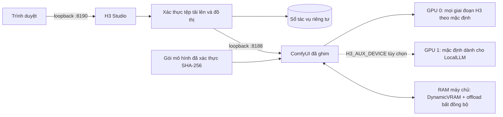

[English](../README.md) · [العربية](README.ar.md) · [Español](README.es.md) · [Français](README.fr.md) · [日本語](README.ja.md) · [한국어](README.ko.md) · [Tiếng Việt](README.vi.md) · [中文 (简体)](README.zh-Hans.md) · [中文（繁體）](README.zh-Hant.md) · [Deutsch](README.de.md) · [Русский](README.ru.md)

[](https://github.com/lachlanchen/lachlanchen/blob/main/figs/banner.png)

# LocalVideoGen

*Tạo video MiniMax H3 cục bộ với chất lượng tối đa cho máy trạm hai RTX 4090—hình ảnh, âm thanh và tham chiếu nguyên bản, cùng quyền quản lý tài nguyên thận trọng.*

[](https://lazying.art)
[](../LICENSE)
[](../config/runtime-versions.txt)
[](../workflows/)
[](https://github.com/sponsors/lachlanchen)

LocalVideoGen là lớp vận hành có thể tái lập bao quanh một bản cài ComfyUI bên ngoài đã ghim phiên bản và gói MiniMax H3 chính thức đã căn chỉnh. Dự án cung cấp webapp H3 Studio chỉ truy cập qua loopback, tải mô hình có cổng kiểm tra checksum, các workflow T2V/I2V/R2V, sinh video và âm thanh nguyên bản đồng thời, lịch sử tác vụ bền vững và kiểm soát vòng đời thận trọng được tinh chỉnh cho hai RTX 4090 24 GiB cùng 128 GiB RAM máy chủ.

Với tham chiếu hình ảnh dài, hãy dùng **Long reference · 24 GiB safe**: `quality_int8_offload`, `match` và khung dọc 704×1248 hoặc ngang 1248×704. Cổng kiểm tra trước khi gửi sẽ xác minh kích thước và tải tham chiếu, đồng thời từ chối tác vụ không an toàn trước khi chuyển tới GPU.

| Donate | PayPal | Stripe |
| --- | --- | --- |
| [](https://chat.lazying.art/donate) | [](https://paypal.me/RongzhouChen) | [](https://buy.stripe.com/aFadR8gIaflgfQV6T4fw400) |

## Giao diện H3 Studio

Giao diện sáng trình bày rõ việc thiết lập tham chiếu, điều khiển chất lượng và trạng thái render trong một không gian làm việc cục bộ.


## Tạo loạt video

Bạn có thể chuyển giữa **Single Clip** và **Series** mà không rời H3 Studio. Chế độ series cung cấp **LALACHAN Series**, preset **World Travel** ưu tiên chất lượng và preset trung tính **My Movie** cho mọi dàn nhân vật hoặc phong cách hình ảnh.


- Chỉ tải lên một lần các tham chiếu chung về nhân vật, thế giới, giọng nói và chuyển động, sau đó sắp xếp 2–12 thẻ cảnh có thể chỉnh sửa với prompt, thời lượng và seed riêng.
- **World Travel** khóa bảy ảnh nhân vật/đạo cụ chuẩn tại P1–P7, cấp cho mỗi cảnh một ảnh địa điểm riêng tại P8 và dành P9 cho đúng khung hình cuối của cảnh đã được chấp nhận ngay trước đó. Các tập trước chỉ được dùng để tham chiếu danh tính hoặc giọng nói; chúng không được chi phối quốc gia mới, cốt truyện, dàn cảnh, bảng màu hay bố cục.
- Một cổng tiếp nhận dùng chung giữ mọi lượt render H3 hoàn toàn tuần tự. Khi bật tính liên tục, mỗi cảnh chưa phải cuối đã được xác thực sẽ chuyển khung hình cuối chính xác và đoạn đuôi 2–4 giây đã chọn (mặc định 3 giây) cho cảnh kế tiếp.
- Tạm dừng sau cảnh hiện tại, tiếp tục sau khi khởi động lại, tạo lại một cảnh và các cảnh sau, hoặc thử lại hậu kỳ/ghép cuối mà không tốn GPU cho MP4 đã hợp lệ.
- Mọi lần render đều được giữ lại. Phim cuối chỉ được ghép bằng sao chép luồng không suy hao sau khi kiểm tra số khung hình dự kiến, tốc độ trung bình 24 fps được báo cáo, căn chỉnh âm thanh stereo trong dung sai AAC, giải mã toàn bộ và SHA-256; tệp manifest xác thực cũng được lưu.
- Các dự án cục bộ và phiên Codex khác có thể dùng trình khách Series không phụ thuộc thư viện ngoài, chỉ dựa trên Python stdlib. Trình khách tải lên tham chiếu có giới hạn kích thước, xác minh khả năng của máy chủ, ghi nguyên tử biên nhận chứa ID bền vững trước khi tạo, phục hồi được sau khi tạm dừng duyệt hoặc gián đoạn polling, đồng thời xác minh kích thước và SHA-256 của tạo phẩm trước khi cài đặt tệp tải xuống.

Quy trình lấy cảm hứng từ sự rõ ràng của storyboard Xiaoyunque, nhưng toàn bộ việc tạo video và trạng thái dự án vẫn ở trên máy trạm này qua loopback. Không gọi Xiaoyunque hay dịch vụ tạo nội dung đám mây trả phí nào.

Xem [hướng dẫn quy trình series](../docs/series-workflow.md) để biết cách duy trì tính liên tục và khôi phục, [hướng dẫn Series API liên dự án](../docs/local-series-api.md) để dùng CLI/trình khách stdlib và toàn bộ hợp đồng HTTP, cùng [đánh giá các lựa chọn làm video dài mượt hơn](../docs/smooth-long-video-options.md) để tìm hiểu nền tảng H3 nguyên bản đáng tin cậy, các dự án tính liên tục thử nghiệm, nội suy tùy chọn và cổng kiểm soát chất lượng.

## Những gì dự án cung cấp

- Độ trung thực BF16 cao nhất dành cho tham chiếu video ngắn hoặc R2V chỉ dùng ảnh; tham chiếu video dài mặc định dùng tuyến INT8/offload đã đo và an toàn cho 24 GiB.
- Trên máy trạm dùng chung, GPU 0 mặc định chạy mọi giai đoạn H3 và GPU 1 được để dành cho LocalLLM. Chỉ `H3_AUX_DEVICE=gpu:1` tường minh mới chuyển Qwen và VAE tham chiếu sang GPU 1.
- T2V, I2V và R2V đa tham chiếu cục bộ, gồm preset max-identity và âm thanh nguyên bản đồng bộ.
- Các profile chất lượng, dự phòng một GPU và xem trước INT8 Turbo độ phân giải thấp.
- H3 cục bộ xuất tối đa cạnh ngắn 768 px ở 24 fps. Giai đoạn tái tạo 2K riêng của MiniMax chỉ có qua API và không được giới thiệu như tính năng cục bộ.

## Kiến trúc



Webapp không bao giờ khởi chạy tiến trình ComfyUI thứ hai. Các dịch vụ chỉ bind vào `127.0.0.1`; tệp tải lên được chuẩn hóa thành media có giới hạn, trình duyệt chỉ thấy mã định danh mờ và đường dẫn đầu ra nằm trong allowlist.

## Nội dung hiện có

| Đường dẫn | Mục đích |
| --- | --- |
| [`webapp/`](../webapp/) | H3 Studio đáp ứng, API cục bộ, chuẩn hóa tải lên, sổ tác vụ và kiểm thử |
| [`workflows/dual_gpu/`](../workflows/dual_gpu/) | Workflow BF16/INT8 T2V, I2V, R2V phân theo giai đoạn |
| [`workflows/quality/`](../workflows/quality/) | Workflow chất lượng 25 bước cho một GPU |
| [`workflows/preview/`](../workflows/preview/) | Workflow xem trước INT8 Turbo nhỏ |
| [`scripts/`](../scripts/) | Công cụ tải xuống, xác thực, vòng đời, tài nguyên, smoke test và workflow |
| [`config/model-manifest.sha256`](../config/model-manifest.sha256) | Allowlist chính xác chín tệp mô hình và checksum SHA-256 |
| [`config/runtime-versions.txt`](../config/runtime-versions.txt) | Phiên bản và commit môi trường ngoài đã ghim |

Các thư mục lớn `ComfyUI/`, `workflow_templates/`, trọng số, đầu ra, tệp tải lên, cơ sở dữ liệu và biên nhận runtime là bản cài cục bộ hoặc trạng thái riêng tư/được tạo nên cố ý không được commit.

## Khởi động nhanh

Kho này là lớp điều phối công khai, không phải trình cài đặt phổ dụng. Trước các lệnh dưới đây, hãy cài bản làm việc bên ngoài `ComfyUI/` và `workflow_templates/` tại đúng commit trong [`config/runtime-versions.txt`](../config/runtime-versions.txt), tạo `.venv` bằng ngăn xếp Python/PyTorch/CUDA đã ghi và cài các phụ thuộc ComfyUI upstream. Các cây upstream cố ý không được vendored.

Hàng đợi đầy đủ của mô hình chính thức đã căn chỉnh là **147.804.799.439 byte (137,65 GiB)**. Có thể tiếp tục tải sau gián đoạn, nhưng cần thêm ít nhất 32 GiB dung lượng trống ngoài dữ liệu mô hình.

```bash
git clone https://github.com/lachlanchen/LocalVideoGen.git
cd LocalVideoGen

# Sau khi cài runtime ngoài đã ghim:
./scripts/download_models.sh
./scripts/verify_models.sh
./scripts/status.sh

./scripts/start_comfyui.sh
./scripts/start_webapp.sh
```

Mở <http://127.0.0.1:8190>. ComfyUI vẫn riêng tư tại <http://127.0.0.1:8188>.

Khi không có render đang chạy, chỉ dừng các tiến trình đã được xác minh của dự án này:

```bash
./scripts/stop_webapp.sh
./scripts/stop_comfyui.sh
```

## An toàn và kiểm soát tài nguyên

- Khởi động cần ít nhất 48 GiB RAM khả dụng, 20.000 MiB VRAM trống trên mỗi GPU được yêu cầu và mức dùng swap không quá 75%.
- Tải mô hình chưa hoàn tất hoặc dấu vân tay kích thước/mtime thay đổi sẽ chặn khởi động; cả chín tệp đều được kiểm tra cấu trúc và SHA-256.
- PID, danh tính lần boot, dòng lệnh, quyền sở hữu listener, dấu dịch vụ và trạng thái hàng đợi được xác minh trước thao tác vòng đời.
- Dọn GPU mặc định là dry-run. Dọn rõ ràng dùng đúng pidfd và bảo vệ cây tiến trình dưới `LocalLLM` và `AgenticApp`; không bao giờ tự động dừng tiến trình bên ngoài.
- Swap là khoảng dự phòng khẩn cấp, không thay thế ngưỡng RAM. Dự án chỉ nên có một engine render và một Studio nhẹ.

## Xác thực

Tạo và xác thực workflow tĩnh, đồng thời chạy kiểm thử webapp mà không gửi render:

```bash
./scripts/prepare_workflows.py
./scripts/validate_workflows.py
.venv/bin/python -m unittest discover -s webapp/tests -v
./scripts/verify_models.sh
```

Khi mô hình đã xác thực và GPU 0 rảnh, chạy đồ thị smoke âm thanh-video nguyên bản nhỏ:

```bash
H3_CUDA_DEVICES=0 ./scripts/start_comfyui.sh
./scripts/smoke_test.sh
H3_SMOKE_MODEL=minimax_h3_fl2va_pruned_bf16.safetensors ./scripts/smoke_test.sh
./scripts/stop_comfyui.sh
```

Đầu ra năm khung hình kiểm tra Qwen conditioning, sampling video/âm thanh chung, cả hai VAE, ghép MP4 và khả năng giải mã stream; đây không phải benchmark chất lượng hình ảnh.

## Giấy phép và lãnh thổ mô hình

Mã và tài liệu gốc của LocalVideoGen được phát hành theo [MIT License](../LICENSE). Giấy phép này **không cấp lại phép** cho ComfyUI, workflow templates, trọng số MiniMax H3, thành phần Qwen, FFmpeg, phụ thuộc upstream khác hay tài sản được tạo. Mỗi thành phần giữ nguyên điều khoản riêng.

Không bao gồm conditioner jailbroken hay abliterated: manifest chỉ chấp nhận tệp Comfy-Org đã căn chỉnh `qwen3vl_32b_minimax_h3_nvfp4_awq.safetensors` đúng checksum đã ghi. MiniMax H3 Community License loại EU, Vương quốc Anh, Hàn Quốc và Hoa Kỳ khỏi lãnh thổ áp dụng, đồng thời đặt nghĩa vụ phân phối lại. Hãy xem [model card upstream](https://huggingface.co/MiniMaxAI/MiniMax-H3), [giấy phép](https://huggingface.co/MiniMaxAI/MiniMax-H3/blob/main/LICENSE), luật áp dụng và mọi giấy phép phụ thuộc trước khi tải hoặc dùng trọng số. Dự án không cung cấp tư vấn pháp lý.

## Trích dẫn

Nếu dùng LocalVideoGen trong nghiên cứu, hãy trích dẫn kho này. GitHub đọc [CITATION.cff](../CITATION.cff) và hiển thị bảng **Cite this repository** trên trang kho.

```bibtex
@software{chen_localvideogen_2026,
  author = {Chen, Lachlan},
  title = {LocalVideoGen: Resource-Aware Local MiniMax H3 Video Generation},
  year = {2026},
  version = {0.1.0},
  url = {https://github.com/lachlanchen/LocalVideoGen}
}
```

## Trạng thái và phạm vi

Phiên bản **0.1.0** là bản phát hành nghiên cứu tập trung vào máy trạm, đã xác thực trên Linux với hai RTX 4090 và 128 GiB RAM. Dự án ưu tiên khả năng tái lập, tính toàn vẹn mô hình, chất lượng hình ảnh và cùng tồn tại an toàn với các dự án chạy lâu hơn là hỗ trợ phần cứng rộng hoặc cài một nhấp. Kết quả vẫn mang tính sinh tạo và cần được xem xét trước khi công bố.

Dự án: [github.com/lachlanchen/LocalVideoGen](https://github.com/lachlanchen/LocalVideoGen) · Trang chủ: [lazying.art](https://lazying.art)
