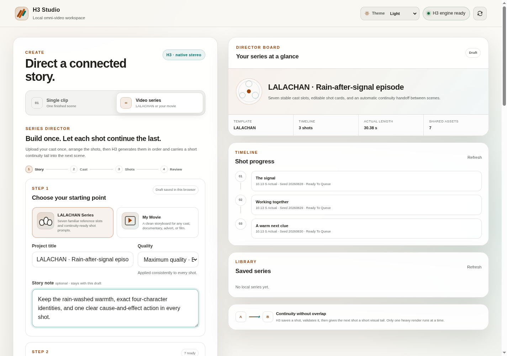
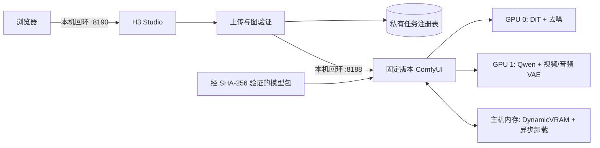

[English](../README.md) · [العربية](README.ar.md) · [Español](README.es.md) · [Français](README.fr.md) · [日本語](README.ja.md) · [한국어](README.ko.md) · [Tiếng Việt](README.vi.md) · [中文 (简体)](README.zh-Hans.md) · [中文（繁體）](README.zh-Hant.md) · [Deutsch](README.de.md) · [Русский](README.ru.md)

[](https://github.com/lachlanchen/lachlanchen/blob/main/figs/banner.png)

# LocalVideoGen

*为双 RTX 4090 工作站打造的最高质量本地 MiniMax H3 视频生成方案——原生画面、声音、参考素材，以及审慎的资源所有权管理。*

[](https://lazying.art)
[](../LICENSE)
[](../config/runtime-versions.txt)
[](../workflows/)
[](https://github.com/sponsors/lachlanchen)

LocalVideoGen 是一个可复现的运行层，围绕固定版本的外部 ComfyUI 安装和官方对齐版 MiniMax H3 模型包构建。它提供仅限本机回环访问的 H3 Studio 网页应用、以校验和为门槛的模型下载、T2V/I2V/R2V 工作流预设、原生视频与音频联合生成、持久任务历史，以及为两张 24 GiB RTX 4090 和 128 GiB 主机内存调校的保守生命周期控制。

| Donate | PayPal | Stripe |
| --- | --- | --- |
| [](https://chat.lazying.art/donate) | [](https://paypal.me/RongzhouChen) | [](https://buy.stripe.com/aFadR8gIaflgfQV6T4fw400) |

## H3 Studio 界面

浅色主题将参考素材设置、质量控制和渲染状态清晰地集中在一个本地工作区中。


## 制作视频系列

无需离开 H3 Studio，即可在 **Single Clip** 与 **Series** 之间切换。系列模式提供带七个命名角色/道具槽位的引导式 **LALACHAN Series** 预设，也提供适合任意演员与视觉风格的中性 **My Movie** 预设。



- 演员、世界观、声音和动作参考只需上传一次，然后可编排 2–12 张分镜卡；每张卡都能独立编辑提示词、时长和种子。
- 一个共享准入门确保所有 H3 渲染严格串行。启用连续性后，每个已验证的非结尾分镜会把精确最后一帧和所设的 2–4 秒尾段（默认 3 秒）交给下一镜。
- 可在当前分镜结束后暂停、重启后继续、重做某一镜及后续镜头，也可只重试后处理或最终拼接，不会为已经有效的 MP4 再花 GPU 时间。
- 每次渲染尝试都会保留。最终影片只有在预期帧数、报告的平均 24 fps、AAC 容差内的立体声音频对齐、完整解码与 SHA-256 全部通过后，才以无损流复制方式拼接；验证清单也会一并保存。

这一工作流借鉴了小云雀分镜体验的清晰度，但所有生成与项目状态都通过本机回环保留在这台工作站上；不会调用小云雀或任何付费云端生成服务。

## 能力概览

- 最高质量预设：裁剪版 BF16 Ref2VA/FL2VA DiT、对齐的 NVFP4-AWQ Qwen3-VL 条件编码器、FP16 视频 VAE、FP32 音频 VAE，以及完整模型 25 步采样。
- 双 GPU 阶段放置：GPU 0 运行 DiT 和去噪；GPU 1 运行 Qwen 条件编码及视频/音频 VAE 阶段，无需假设存在 PCIe 点对点通路。
- 本地 T2V、I2V 和多参考 R2V，包含最大身份保真参考预设与原生同步音频。
- 提供质量模式、单 GPU 回退模式和低分辨率 INT8 Turbo 预览模式。
- 本地 H3 输出在 24 fps 下支持最高 768 像素短边。MiniMax 独立的 2K 再生成阶段仅提供 API，本项目不把它宣传为本地功能。

## 架构



网页应用绝不会启动第二个 ComfyUI 进程。服务仅绑定 `127.0.0.1`；上传会被规范化为受限媒体，浏览器看到的是不透明标识符，输出路径采用允许列表。

## 当前内容

| 路径 | 用途 |
| --- | --- |
| [`webapp/`](../webapp/) | 响应式 H3 Studio、本地 API、上传规范化、任务注册表与测试 |
| [`workflows/dual_gpu/`](../workflows/dual_gpu/) | BF16/INT8 T2V、I2V、R2V 阶段放置工作流 |
| [`workflows/quality/`](../workflows/quality/) | 单 GPU 25 步质量工作流 |
| [`workflows/preview/`](../workflows/preview/) | 小型 INT8 Turbo 预览工作流 |
| [`scripts/`](../scripts/) | 下载、验证、生命周期、资源、冒烟测试和工作流工具 |
| [`config/model-manifest.sha256`](../config/model-manifest.sha256) | 精确的九文件模型允许列表及 SHA-256 校验和 |
| [`config/runtime-versions.txt`](../config/runtime-versions.txt) | 固定的外部运行时版本与提交 |

体积巨大的 `ComfyUI/`、`workflow_templates/`、模型权重、输出、上传、数据库和运行时回执属于本地安装或私有/生成状态，因此不会提交到仓库。

## 快速开始

本仓库是公开编排层，不是通用安装器。使用以下命令前，请按 [`config/runtime-versions.txt`](../config/runtime-versions.txt) 中的精确提交安装外部 `ComfyUI/` 与 `workflow_templates/` 工作副本，使用记录的 Python/PyTorch/CUDA 栈创建 `.venv`，并安装上游 ComfyUI 依赖。上游源码树特意没有内嵌到本仓库。

完整的官方对齐模型下载队列为 **147,804,799,439 字节（137.65 GiB）**。下载支持断点续传，但除模型数据外还应预留至少 32 GiB 可用空间。

```bash
git clone https://github.com/lachlanchen/LocalVideoGen.git
cd LocalVideoGen

# 安装固定版本的外部运行时之后：
./scripts/download_models.sh
./scripts/verify_models.sh
./scripts/status.sh

./scripts/start_comfyui.sh
./scripts/start_webapp.sh
```

打开 <http://127.0.0.1:8190>。ComfyUI 仍仅在 <http://127.0.0.1:8188> 私有访问。

没有活跃渲染时，仅停止本项目已经核实的进程：

```bash
./scripts/stop_webapp.sh
./scripts/stop_comfyui.sh
```

## 安全与资源控制

- 启动至少需要 48 GiB 可用内存、每张请求使用的 GPU 有 20,000 MiB 空闲显存，并且交换空间使用率不高于 75%。
- 未完成的模型下载或发生变化的模型大小/修改时间指纹会阻止启动；九个文件全部经过结构检查与 SHA-256 验证。
- 生命周期操作前会核实 PID、启动身份、命令行、监听端口所有权、服务标记和队列状态。
- GPU 清理默认为只读演练。显式清理使用精确 pidfd，并保护根目录位于 `LocalLLM` 与 `AgenticApp` 的进程树；绝不会自动停止外部进程。
- 交换空间只是应急余量，不能代替内存启动门槛。本项目只应保留一个渲染引擎和一个轻量 Studio。

## 验证

无需提交渲染即可运行静态工作流生成/验证和网页应用测试：

```bash
./scripts/prepare_workflows.py
./scripts/validate_workflows.py
.venv/bin/python -m unittest discover -s webapp/tests -v
./scripts/verify_models.sh
```

模型验证完成且 GPU 0 空闲时，可运行微型原生音视频冒烟图：

```bash
H3_CUDA_DEVICES=0 ./scripts/start_comfyui.sh
./scripts/smoke_test.sh
H3_SMOKE_MODEL=minimax_h3_fl2va_pruned_bf16.safetensors ./scripts/smoke_test.sh
./scripts/stop_comfyui.sh
```

五帧冒烟输出会检查 Qwen 条件编码、视频/音频联合采样、两个 VAE、MP4 封装和流可解码性；它不是视觉质量基准。

## 许可证与模型适用地区

LocalVideoGen 的原创代码与文档按 [MIT License](../LICENSE) 发布。该许可证**不会**重新许可 ComfyUI、工作流模板、MiniMax H3 权重、Qwen 组件、FFmpeg、任何其他上游依赖或生成资产；它们各自保留原有条款。

本项目不包含越狱或消除拒答的条件编码器：清单只接受校验和与记录一致的对齐版 Comfy-Org `qwen3vl_32b_minimax_h3_nvfp4_awq.safetensors`。MiniMax H3 Community License 将欧盟、英国、大韩民国和美国排除在适用地区之外，并规定了再分发义务；下载或使用权重前，请审阅[上游模型卡](https://huggingface.co/MiniMaxAI/MiniMax-H3)、[许可证](https://huggingface.co/MiniMaxAI/MiniMax-H3/blob/main/LICENSE)、适用法律及所有依赖的许可证。本项目不构成法律建议。

## 引用

若在研究中使用 LocalVideoGen，请引用本仓库。GitHub 会读取 [CITATION.cff](../CITATION.cff)，并在仓库页面显示 **Cite this repository** 面板。

```bibtex
@software{chen_localvideogen_2026,
  author = {Chen, Lachlan},
  title = {LocalVideoGen: Resource-Aware Local MiniMax H3 Video Generation},
  year = {2026},
  version = {0.1.0},
  url = {https://github.com/lachlanchen/LocalVideoGen}
}
```

## 状态与范围

版本 **0.1.0** 是面向特定工作站的研究版本，已在配备两张 RTX 4090 和 128 GiB 内存的 Linux 系统上验证。它优先考虑可复现性、模型完整性、视觉质量以及与其他长期项目安全共存，而非广泛硬件支持或一键安装。结果仍由生成模型产生，发布前应人工审查。

项目：[github.com/lachlanchen/LocalVideoGen](https://github.com/lachlanchen/LocalVideoGen) · 主页：[lazying.art](https://lazying.art)
