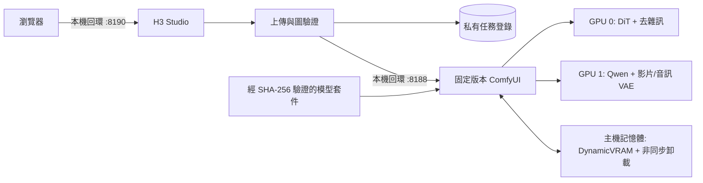

[English](../README.md) · [العربية](README.ar.md) · [Español](README.es.md) · [Français](README.fr.md) · [日本語](README.ja.md) · [한국어](README.ko.md) · [Tiếng Việt](README.vi.md) · [中文 (简体)](README.zh-Hans.md) · [中文（繁體）](README.zh-Hant.md) · [Deutsch](README.de.md) · [Русский](README.ru.md)

[](https://github.com/lachlanchen/lachlanchen/blob/main/figs/banner.png)

# LocalVideoGen

*為雙 RTX 4090 工作站打造的最高品質本機 MiniMax H3 影片生成方案——原生畫面、聲音、參考素材，以及審慎的資源所有權管理。*

[](https://lazying.art)
[](../LICENSE)
[](../config/runtime-versions.txt)
[](../workflows/)
[](https://github.com/sponsors/lachlanchen)

LocalVideoGen 是一個可重現的運行層，圍繞固定版本的外部 ComfyUI 安裝與官方對齊版 MiniMax H3 模型套件建構。它提供僅限本機回環存取的 H3 Studio 網頁應用程式、以校驗碼為門檻的模型取得、T2V/I2V/R2V 工作流程預設、原生影片與音訊聯合生成、持久任務歷史，以及為兩張 24 GiB RTX 4090 與 128 GiB 主機記憶體調校的保守生命週期控制。

| Donate | PayPal | Stripe |
| --- | --- | --- |
| [](https://chat.lazying.art/donate) | [](https://paypal.me/RongzhouChen) | [](https://buy.stripe.com/aFadR8gIaflgfQV6T4fw400) |

## H3 Studio 介面

淺色主題將參考素材設定、品質控制與渲染狀態清楚集中在一個本機工作區中。


## 製作影片系列

無須離開 H3 Studio，即可在 **Single Clip** 與 **Series** 之間切換。系列模式提供 **LALACHAN Series**、品質優先的 **World Travel** 預設，以及適合任何演員與視覺風格的中性 **My Movie** 預設。


- 演員、世界觀、聲音與動作參考只需上傳一次，之後可編排 2–12 張分鏡卡；每張卡都能獨立編輯提示詞、時長與種子。
- **World Travel** 將七張標準角色／道具圖鎖定為 P1–P7，為每個分鏡配置專屬目的地場景圖 P8，並將 P9 保留給上一個已驗收分鏡的精確最後一幀。過往劇集只能提供身分或聲音參考；不得影響新國家、劇情、走位、色彩或構圖。
- 一個共用准入閘確保所有 H3 渲染嚴格循序進行。啟用連續性後，每個已驗證的非結尾分鏡會把精確最後一幀和所設的 2–4 秒尾段（預設 3 秒）交給下一鏡。
- 可在目前分鏡結束後暫停、重新啟動後繼續、重做某一鏡及其後續鏡頭，也可只重試後處理或最終串接，不會為已有效的 MP4 再耗費 GPU 時間。
- 每次渲染嘗試都會保留。最終影片只有在預期幀數、回報的平均 24 fps、AAC 容差內的立體聲音訊對齊、完整解碼及 SHA-256 全數通過後，才以無損串流複製方式串接；驗證清單亦會保留。
- 其他本機專案與 Codex 工作階段可使用僅依賴 Python stdlib、無第三方相依套件的 Series 用戶端。它會在限定大小內上傳參考素材、驗證伺服器功能，並在生成前以不可分割方式寫入含持久 ID 的收據；即使審核暫停或輪詢中斷仍可接續，且會在安裝下載檔前核對產物大小與 SHA-256。

這套流程借鑑了小雲雀分鏡體驗的清晰度，但所有生成與專案狀態都透過本機回環保留在此工作站；不會呼叫小雲雀或任何付費雲端生成服務。

關於連續性與復原行為，請參閱[系列工作流程指南](../docs/series-workflow.md)；關於 stdlib CLI／用戶端及完整 HTTP 契約，請參閱[跨專案 Series API 指南](../docs/local-series-api.md)；關於可信的原生 H3 基準、實驗性連續性專案、可選插幀與品質閘門，請參閱[流暢長影片方案評述](../docs/smooth-long-video-options.md)。

## 功能概覽

- 最高品質預設：裁剪版 BF16 Ref2VA/FL2VA DiT、對齊的 NVFP4-AWQ Qwen3-VL 條件編碼器、FP16 影片 VAE、FP32 音訊 VAE，以及完整模型 25 步採樣。
- 雙 GPU 階段配置：GPU 0 執行 DiT 與去雜訊；GPU 1 執行 Qwen 條件編碼及影片/音訊 VAE 階段，不假設存在 PCIe 點對點通路。
- 本機 T2V、I2V 與多參考 R2V，包含最高身分一致性參考預設與原生同步音訊。
- 提供品質模式、單 GPU 備援模式與低解析度 INT8 Turbo 預覽模式。
- 本機 H3 輸出在 24 fps 下支援最高 768 像素短邊。MiniMax 獨立的 2K 再生成階段僅提供 API，本專案不將其描述為本機功能。

## 架構



網頁應用程式絕不會啟動第二個 ComfyUI 程序。服務僅綁定 `127.0.0.1`；上傳會被正規化為受限媒體，瀏覽器看到的是不透明識別碼，輸出路徑採用允許清單。

## 目前內容

| 路徑 | 用途 |
| --- | --- |
| [`webapp/`](../webapp/) | 響應式 H3 Studio、本機 API、上傳正規化、任務登錄與測試 |
| [`workflows/dual_gpu/`](../workflows/dual_gpu/) | BF16/INT8 T2V、I2V、R2V 階段配置工作流程 |
| [`workflows/quality/`](../workflows/quality/) | 單 GPU 25 步品質工作流程 |
| [`workflows/preview/`](../workflows/preview/) | 小型 INT8 Turbo 預覽工作流程 |
| [`scripts/`](../scripts/) | 下載、驗證、生命週期、資源、冒煙測試與工作流程工具 |
| [`config/model-manifest.sha256`](../config/model-manifest.sha256) | 精確的九檔案模型允許清單與 SHA-256 校驗碼 |
| [`config/runtime-versions.txt`](../config/runtime-versions.txt) | 固定的外部運行時版本與提交 |

體積龐大的 `ComfyUI/`、`workflow_templates/`、模型權重、輸出、上傳、資料庫與運行時回執屬於本機安裝或私有/生成狀態，因此刻意不提交到儲存庫。

## 快速開始

本儲存庫是公開編排層，不是通用安裝器。使用以下命令前，請按 [`config/runtime-versions.txt`](../config/runtime-versions.txt) 中的精確提交安裝外部 `ComfyUI/` 與 `workflow_templates/` 工作副本，使用記錄的 Python/PyTorch/CUDA 堆疊建立 `.venv`，並安裝上游 ComfyUI 相依項目。上游原始碼樹刻意沒有內嵌於本儲存庫。

完整的官方對齊模型下載佇列為 **147,804,799,439 位元組（137.65 GiB）**。下載支援續傳，但除模型資料外還應預留至少 32 GiB 可用空間。

```bash
git clone https://github.com/lachlanchen/LocalVideoGen.git
cd LocalVideoGen

# 安裝固定版本的外部運行時之後：
./scripts/download_models.sh
./scripts/verify_models.sh
./scripts/status.sh

./scripts/start_comfyui.sh
./scripts/start_webapp.sh
```

開啟 <http://127.0.0.1:8190>。ComfyUI 仍僅在 <http://127.0.0.1:8188> 私有存取。

沒有進行中的渲染時，僅停止本專案已核實的程序：

```bash
./scripts/stop_webapp.sh
./scripts/stop_comfyui.sh
```

## 安全與資源控制

- 啟動至少需要 48 GiB 可用記憶體、每張要求使用的 GPU 有 20,000 MiB 可用顯示記憶體，且交換空間使用率不高於 75%。
- 未完成的模型下載或已變更的模型大小/修改時間指紋會阻止啟動；九個檔案全部經過結構檢查與 SHA-256 驗證。
- 生命週期操作前會核實 PID、啟動身分、命令列、監聽連接埠所有權、服務標記和佇列狀態。
- GPU 清理預設為唯讀演練。明確清理使用精確 pidfd，並保護根目錄位於 `LocalLLM` 與 `AgenticApp` 的程序樹；絕不自動停止外部程序。
- 交換空間只是緊急餘量，不能替代記憶體啟動門檻。本專案只應保留一個渲染引擎與一個輕量 Studio。

## 驗證

無需提交渲染即可執行靜態工作流程生成/驗證及網頁應用程式測試：

```bash
./scripts/prepare_workflows.py
./scripts/validate_workflows.py
.venv/bin/python -m unittest discover -s webapp/tests -v
./scripts/verify_models.sh
```

模型驗證完成且 GPU 0 閒置時，可執行微型原生音訊影片冒煙圖：

```bash
H3_CUDA_DEVICES=0 ./scripts/start_comfyui.sh
./scripts/smoke_test.sh
H3_SMOKE_MODEL=minimax_h3_fl2va_pruned_bf16.safetensors ./scripts/smoke_test.sh
./scripts/stop_comfyui.sh
```

五影格冒煙輸出會檢查 Qwen 條件編碼、影片/音訊聯合採樣、兩個 VAE、MP4 封裝與串流可解碼性；它不是視覺品質基準。

## 授權條款與模型適用地區

LocalVideoGen 的原創程式碼與文件依 [MIT License](../LICENSE) 發布。該授權**不會**重新授權 ComfyUI、工作流程範本、MiniMax H3 權重、Qwen 元件、FFmpeg、任何其他上游相依項目或生成資產；它們各自保留原有條款。

本專案不包含越獄或消除拒答的條件編碼器：清單僅接受校驗碼與記錄一致的對齊版 Comfy-Org `qwen3vl_32b_minimax_h3_nvfp4_awq.safetensors`。MiniMax H3 Community License 將歐盟、英國、大韓民國與美國排除在適用地區之外，並規定再散布義務；下載或使用權重前，請審閱[上游模型卡](https://huggingface.co/MiniMaxAI/MiniMax-H3)、[授權條款](https://huggingface.co/MiniMaxAI/MiniMax-H3/blob/main/LICENSE)、適用法律及所有相依項目的授權。本專案不提供法律意見。

## 引用

若在研究中使用 LocalVideoGen，請引用本儲存庫。GitHub 會讀取 [CITATION.cff](../CITATION.cff)，並在儲存庫頁面顯示 **Cite this repository** 面板。

```bibtex
@software{chen_localvideogen_2026,
  author = {Chen, Lachlan},
  title = {LocalVideoGen: Resource-Aware Local MiniMax H3 Video Generation},
  year = {2026},
  version = {0.1.0},
  url = {https://github.com/lachlanchen/LocalVideoGen}
}
```

## 狀態與範圍

版本 **0.1.0** 是針對特定工作站的研究版本，已在配備兩張 RTX 4090 與 128 GiB 記憶體的 Linux 系統上驗證。它優先考慮可重現性、模型完整性、視覺品質，以及與其他長期執行專案安全共存，而非廣泛硬體支援或一鍵安裝。結果仍由生成模型產生，發布前應人工審查。

專案：[github.com/lachlanchen/LocalVideoGen](https://github.com/lachlanchen/LocalVideoGen) · 首頁：[lazying.art](https://lazying.art)
